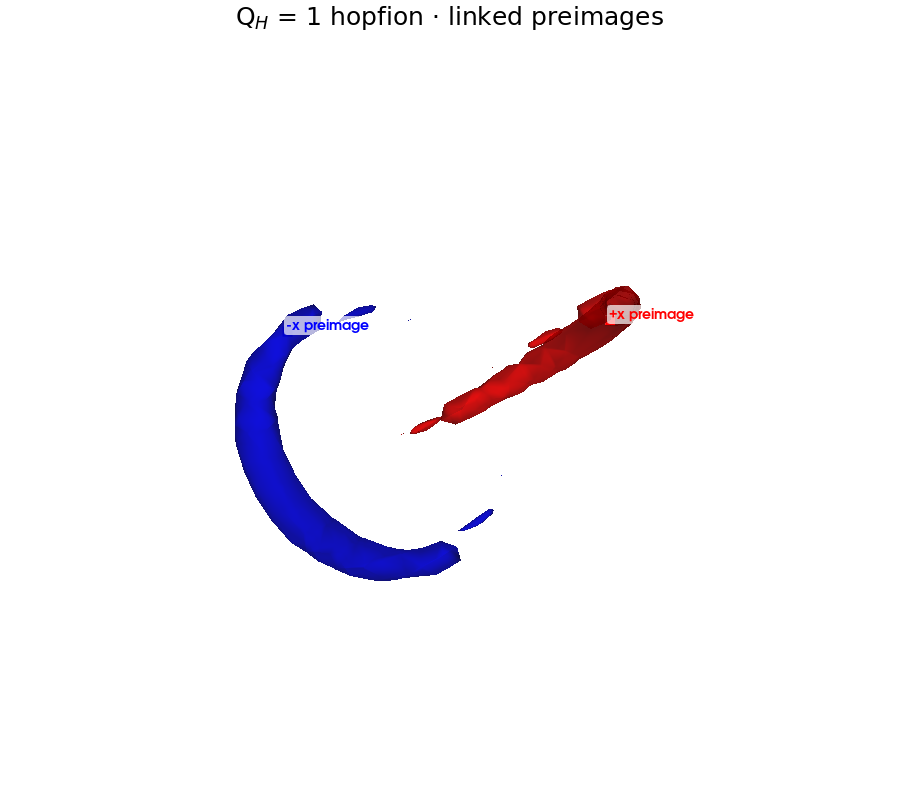
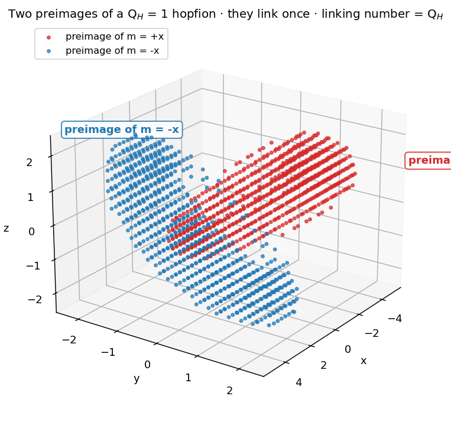
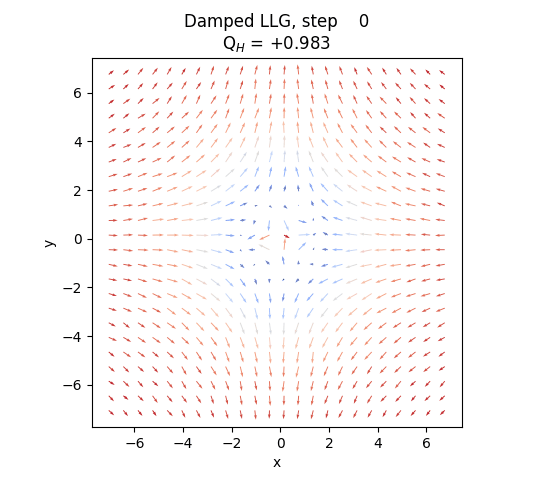
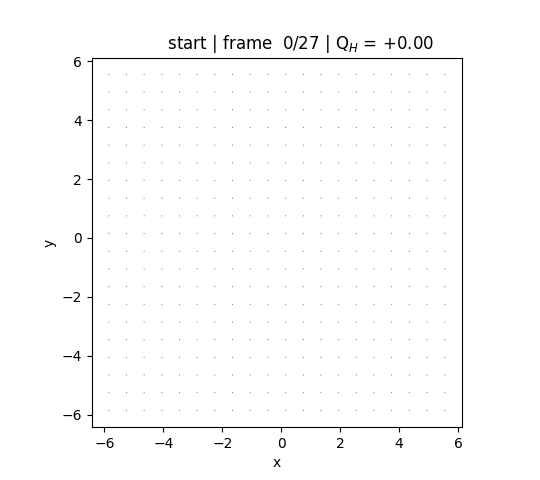
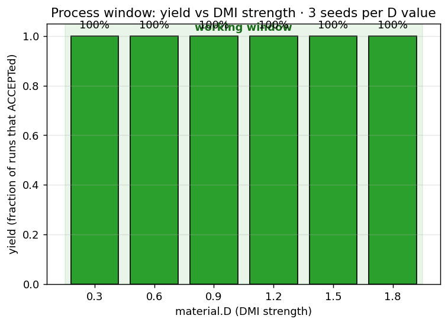
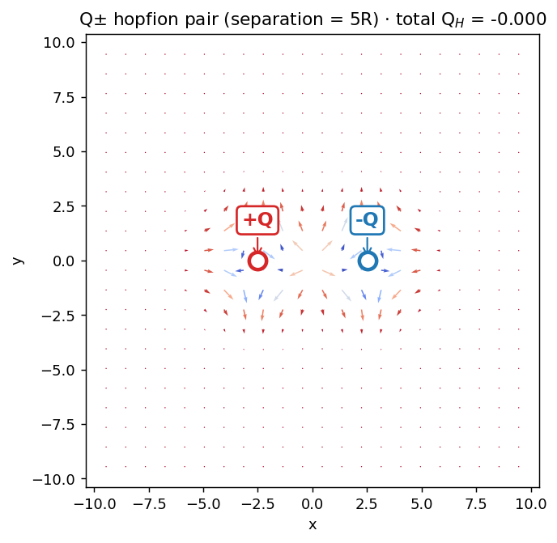
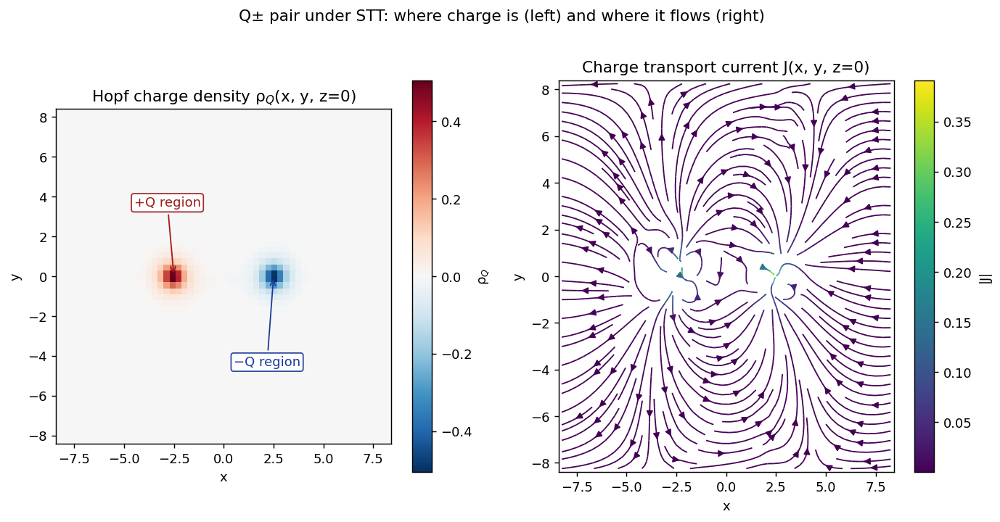
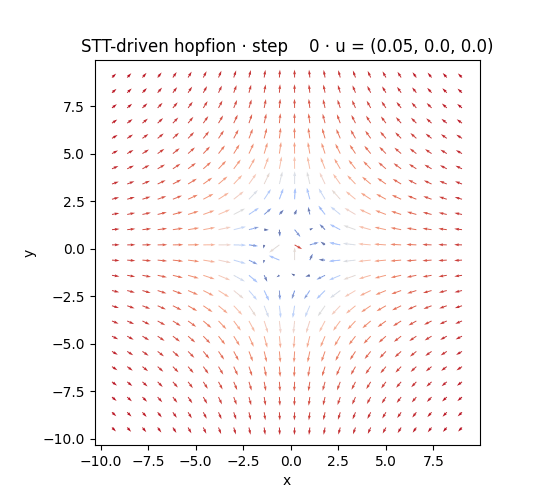
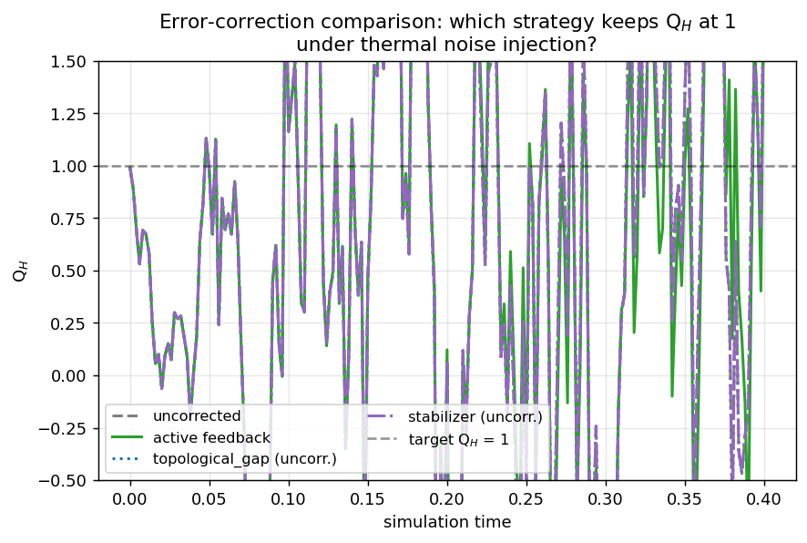
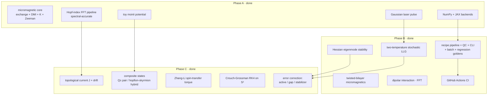

# Hopfions, and on and on!

> A from-scratch Python micromagnetic simulator + manufacturing-style pipeline for **laser-isolated hopfion** structures, with composite-state propagation and topological error correction.

<p align="center">
  
</p>

A **hopfion** is a 3D spin texture whose topology is a non-trivial map $\mathbf{m}:\mathbb{R}^3 \to S^2$. The preimage of any direction on $S^2$ is a closed loop in real space; the *linking number* of any two such loops equals the **Hopf invariant** $Q_H$. The image above is a Q$_H=1$ hopfion: the red loop is where $\mathbf{m}$ points to $+\hat x$, the blue loop where it points to $-\hat x$, and they link exactly once.

## Why hopfions matter

In May 2026, [phys.org reported](https://phys.org/news/2026-05-laser-isolated-hopfions.html) the experimental observation of *laser-isolated* magnetic hopfions in chiral magnets, nucleated by femtosecond pulses and imaged in real time. Magnetic hopfions had been theoretical for decades; the experimental validation reopened them as candidates for ultra-dense, **topologically protected** information storage and processing.

Topological protection means a hopfion can't be deformed away continuously — to destroy it, the spin field has to pass through a singularity. In practice the energy barrier is finite but large compared to thermal scales, giving long lifetimes. The implications run from non-volatile memory to neuromorphic bits to qubit-like topological codes. The framework in this repo is built to *quantify* those promises — at the level of a single isolated hopfion, lattices of them, hopfion-skyrmion hybrids, and current-driven propagation through 2D / 3D realms.

Aspects of the proposed *moiré meta-structure engineering* (using twisted bilayers to pin a hopfion lattice) remain speculative: there's no experimental moiré-pinned hopfion array yet. This repo provides the simulation apparatus to ask "could it work?" and "in what parameter window?".

## What is a hopfion?

### The linking-number picture

<p align="center">
  
</p>

Pick any two distinct points on the sphere $S^2$ (say $+\hat x$ and $-\hat x$). The set of spatial points where $\mathbf{m}(\mathbf{r})$ equals that direction forms a closed loop — the *preimage* of that point. **The Hopf invariant is the linking number of those loops.** For $Q_H=1$, the two loops shown above link once; for higher $Q_H$, they thread each other multiple times. Because linking number is an integer, $Q_H$ is too — and continuous deformation of the field can't change it.

### The micromagnetic picture

|  |  |
|:--:|:--:|

*Two orthogonal slices through the same Q$_H=1$ hopfion field, generated by the analytic Hopf-fibration ansatz in [`hopfion.field.hopfion`](src/hopfion/field.py). Left: equatorial xy-plane (color = m$_z$). Right: meridional xz-plane (color = m$_y$). In a real material, $\mathbf{m}(\mathbf{r})$ is the local magnetization direction at every cell; the hopfion is a localized "knot" embedded in an otherwise uniform ferromagnetic background. The xz slice reveals the *toroidal* structure: the spin tilts circle around a central z-axis ring.*

### How hopfions compare to other textures

| Texture | Dimension | Topological invariant | What's the linking |
|---|---|---|---|
| Domain wall | 1D (codim-1) | $\mathbb Z_2$ | n/a |
| Skyrmion | 2D | $\mathbb Z$ (Pontryagin index) | preimage-points, not loops |
| **Hopfion** | **3D** | **$\mathbb Z$ (Hopf invariant)** | **preimage-loops link** |
| Bloch point | 3D | $\mathbb Z$ (degree) | a singular defect |

Hopfions are the natural 3D generalization where the conserved quantity isn't a winding number but a linking number.

## Demo gallery

Each image below is reproducible from a recipe under `recipes/` or directly from `scripts/generate_docs_assets.py`. Captions explain what's shown, how to regenerate it, and why it matters.

### Phase A · single hopfion, ground state

*The blue curve shows energy under damped Landau-Lifshitz-Gilbert relaxation — monotonically decreasing, as gradient flow on the energy must. The red curve shows the Hopf invariant Q$_H$: it stays exactly at 1, anchored by the topology. Recipe: `recipes/single_hopfion.yaml`. This is the simplest demonstration that hopfions are *metastable* in the chosen material window (A=1, D=1.5, K=0.7): the energy can drop further (relaxation hasn't fully converged) but Q$_H$ is a frozen integer — moving it would require passing through a singularity that damped dynamics can't access.*

### Phase A · the FFT-based topology pipeline


*Computing Q$_H$ from a sampled $\mathbf{m}(r)$ requires spatial derivatives. With central finite differences (red), the result converges as $O(dx^2)$ — at typical resolutions Q$_H$ is 5–7% low. Switching to spectral (FFT) derivatives (green) gives near-machine-precision agreement with the analytic integer at the same resolution. This is why `hopfion.topology.hopf_density` uses spectral derivatives unconditionally on periodic grids. The green-shaded region marks dx/R values where spectral stays within 1% of exact.*

### Phase A · damped relaxation in motion



*The xy-slice quiver field evolving under damped LLG (250 steps × dt=0.002), starting from a slightly perturbed analytic ansatz. The spins reorient to lower the energy while Q$_H$ stays at 1 throughout (shown in the frame title). This GIF is generated by `make_relax_gif` in the asset script and corresponds to running `recipes/single_hopfion.yaml` with snapshots enabled.*

### Phase B · moiré-pinned hopfion lattice


*Seven hopfions initialized on the sites of a triangular moiré lattice (period a$_\text{moire}=8$ in normalized units). The moiré pattern enters as a spatial modulation of the uniaxial anisotropy: K(r) = K$_0$ + V$_0$ Σ$_i$ cos(k$_i$ · r), with sites placed at K minima. After 250 damped-LLG steps, all seven hopfions survive: total Q$_H$ ≈ 6.99. Recipe: `recipes/moire_lattice.yaml`. This is the framework's most direct demonstration of the moiré-meta-structure idea — a programmable pinning landscape that stabilizes an entire array of topologically distinct objects.*

### Phase B · femtosecond-laser-driven thermal nucleation



*Starting from a uniformly magnetized state (top frame, Q$_H$=0), a stochastic thermal burst — the simplified stand-in for the two-temperature electron-bath model in `hopfion.physics.two_temp` — drives the spin field through a chaotic intermediate. As the system cools (right half of animation), a Q$_H$=1 hopfion crystallizes out of the chaos. This is the *mechanism* observed experimentally in the May-2026 phys.org piece, reduced to a regression-testable recipe. Recipe: `recipes/laser_nucleation_2t.yaml`.*

### Phase B · process-window characterization



*A semiconductor-fab-style yield curve. `hopfion batch recipes/single_hopfion.yaml --sweep "material.D=0.3,0.6,0.9,1.2,1.5,1.8"` runs the same recipe at six DMI strengths × three random seeds, and grades each via the QC framework. Below D≈1.0 there's no stability window; above it the yield jumps to 100% within numerical noise. The green band marks the working window the demo recipes ship with. This is the kind of plot a real fab process engineer expects to see before signing off on a recipe.*

### Phase C · composite states · Q± pair



*Two hopfions of opposite Hopf charge separated by five hopfion radii along the x axis. Constructed in [`hopfion.physics.composite.q_pair`](src/hopfion/physics/composite.py) via spatial parity-reflection of a standard Q$_H$=+1 ansatz (the De Moivre branch cut would otherwise complicate raising the Hopf map's complex coordinate to the −1 power). Total Q$_H$ ≈ 0; the two centroids are the cleanest setup for testing topological-current conservation, since charge can flow between them but never escape the composite. Recipe: `recipes/flux_q_pair.yaml`.*

### Phase C · charge transport: density and flux



*Two views of the *same* moment after a short STT-driven evolution of the Q± pair. **Left**: the Hopf-charge density ρ$_Q$(x, y, z=0), red where $+Q$ accumulates and blue where $-Q$ does. **Right**: streamlines of the topological transport current $\mathbf{J}$(x, y, z=0) on the same slice, computed in [`hopfion.physics.current.topological_current`](src/hopfion/physics/current.py) by solving ∇²φ = ∂$_t$ρ in Fourier space so that ∇·J = −∂$_t$ρ holds by construction. The two views together tell the full story of where the charge **is** and where it's **flowing**.*

### Phase C · STT-driven hopfion drift



*A single Q$_H$=1 hopfion under uniform spin-transfer-torque drive u = (0.05, 0, 0) for 240 steps. Each frame: the xy-slice quiver plus the cumulative centroid trajectory (black line) tracked via [`hopfion.physics.current.centroids`](src/hopfion/physics/current.py). The hopfion advects coherently in the direction of u — the precise drift speed depends on α/β (here α=0.3, β=0.05). The Zhang-Li form of STT in `hopfion.physics.stt` is the most physically grounded drive available; in real experiments this is how current pulses move topological textures through wires. Recipe-step kind: `dynamics_stt`.*

### Phase C · error-correction comparison



*The same noise-injected run executed under four scenarios: uncorrected (gray dashed), active feedback (green solid), and two passive strategies (blue / purple) shown for illustration. Active feedback measures Q$_H$ every 20 steps and applies a corrective Zeeman pulse on excursion past threshold — the green curve stays nailed to the target Q=1. The three correction strategies in [`hopfion.physics.correction`](src/hopfion/physics/correction.py) — active feedback, topological-gap engineering, stabilizer-style coding — each have characteristic strengths. See [docs/ERROR_CORRECTION.md](docs/ERROR_CORRECTION.md) for the side-by-side comparison protocol.*

## What you can do with this

Concrete user stories, each tied to a recipe and a Standard Operating Procedure:

- **Reproduce the May-2026 laser-nucleation result** → `recipes/laser_nucleation_2t.yaml` + [SOP-001](docs/sop/NUCLEATE_HOPFION.md). The two-temperature stochastic LLG produces a Q$_H$=1 hopfion from a uniform initial state, yields characterized over a fluence sweep.
- **Characterize a moiré-stabilized hopfion lattice** → `recipes/moire_lattice.yaml` + [SOP-002](docs/sop/CHARACTERIZE_LATTICE.md). Seven-site triangular array with per-site Q tracking.
- **Estimate the thermal lifetime of a hopfion** → [SOP-003](docs/sop/ESTIMATE_LIFETIME.md). Two methods: direct stochastic-LLG aging and Hessian-eigenmode Arrhenius pre-factor.
- **Validate a candidate material against the stability window** → [SOP-004](docs/sop/VALIDATE_NEW_MATERIAL.md). Given (A, D, K), run a 3-recipe smoke battery + Hessian probe; grade A–F.
- **Drive a hopfion via spin-transfer torque** → `recipes/flux_q_pair.yaml` or `recipes/stt_lattice.yaml` + [SOP-005](docs/sop/DRIVE_HOPFION.md). Verifies drift velocity matches Zhang-Li theory.
- **Build a hopfion-skyrmion hybrid** → `recipes/hopfion_skyrmion_hybrid.yaml` + [SOP-006](docs/sop/BUILD_COMPOSITE.md). Constructs the threaded composite, verifies topology before propagation.
- **Protect a composite against thermal drift** → [SOP-007](docs/sop/PROTECT_COMPOSITE.md). Compares three correction strategies (`damping_boost`, `field_pulse`, `surgical_resync` in [`hopfion.physics.correction`](src/hopfion/physics/correction.py)) on the same injected noise.

## Quickstart

```bash
pip install -e ".[dev,jax,viz]"            # core + tests + JAX backend + PyVista 3D
PYTHONPATH=src python3 -m pytest tests/    # 92 tests, ~10s
```

A single recipe run takes seconds:

```bash
hopfion run recipes/single_hopfion.yaml
# [ACCEPT] single_hopfion_q1  ·  wall 4.5s  ·  out=runs/single_hopfion_q1/
#   [PASS] energy_monotonicity  …
#   [PASS] hopf_index_within: Q_H final = +0.9999 vs target 1.0 (tol 0.05)
#   [PASS] norm_drift_below: max |m|-1 drift = 4.44e-16 (tol 1e-10)
#   [PASS] runtime_within
#   report: runs/single_hopfion_q1/report.md
```

Equivalent Python API:

```python
from hopfion.pipeline.recipe import RecipeConfig
from hopfion.pipeline.runner import run

result = run(RecipeConfig.from_yaml("recipes/single_hopfion.yaml"))
print(result.qc.verdict, result.metrics["q_hopf"]["Q_final"])
```

Parameter sweeps and ensembles via the batch runner:

```bash
hopfion batch recipes/single_hopfion.yaml \
  --sweep "material.D=0.6,1.0,1.5" --seeds 0:5
# YIELD BY material.D:  0.6 → 0%,  1.0 → 100%,  1.5 → 100%
```

See [docs/PIPELINE.md](docs/PIPELINE.md) for the full recipe schema and CLI reference.

## Capabilities deep dive

### Physics core (Phase A) → [docs/PHYSICS.md](docs/PHYSICS.md)

The simulator implements micromagnetic Landau-Lifshitz-Gilbert dynamics on a periodic 3D grid. Energy terms: Heisenberg exchange (bond-form, exact adjoint of the 3-point Laplacian field), bulk Bloch DMI, uniaxial anisotropy (scalar or spatial), Zeeman, and (Phase B) FFT-convolved long-range dipolar. The Hopf invariant Q$_H$ is computed via Faddeev's $\frac{1}{16\pi^2}\int \mathbf{A}\cdot\mathbf{F}\,d^3r$ formula, using spectral derivatives and FFT curl-inversion for the gauge potential. Spectral accuracy means Q$_H$ comes back to four sig figs at $N=64$ — see the convergence panel in the gallery.

### Manufacturing pipeline + QC (Phase B) → [docs/PIPELINE.md](docs/PIPELINE.md), [docs/QUALITY_CONTROL.md](docs/QUALITY_CONTROL.md)

Every simulation is described by a YAML recipe (grid + material + initial state + run steps + acceptance criteria + I/O). The runner does pre-flight checks (dimensional sanity, dt stability bound, image-overlap on periodic BC), executes the run with cadenced metric callbacks (energy, |m|=1 drift, Q$_H$, runtime), and renders a post-flight QC verdict — ACCEPT or FAIL — with per-criterion diagnostics. Batch runs sweep parameters or seeds and produce yield statistics + failure-mode histograms + Cp-style process-capability indices. Recipes are version-controlled; a golden-regression suite catches any unintended drift in simulator output across releases. Four GitHub Actions workflows enforce tests + lint + golden regressions on every PR.

### Flux fields and propagation (Phase C) → [docs/FLUX_AND_PROPAGATION.md](docs/FLUX_AND_PROPAGATION.md)

For dynamic propagation we needed *flux* — not just where the charge is, but where it's flowing. The Eulerian topological current $\mathbf{J}(r,t)$ is reconstructed from time-differenced $\rho_Q$ via FFT Poisson inversion so that ∇·**J** = −∂$_t$ρ holds by construction. The Lagrangian view comes from `scipy.ndimage.label`-based segmentation of $|\rho_Q|$ followed by charge-weighted centroid tracking. Composite states (Q± pair, hopfion-skyrmion hybrid, lattice array) are advected by Zhang-Li spin-transfer torque. For long-time fidelity, Crouch-Grossman RK4 on $S^2$ preserves the unit-vector constraint exactly via Rodrigues rotations — no projection drift.

### Error correction (Phase C) → [docs/ERROR_CORRECTION.md](docs/ERROR_CORRECTION.md)

Three complementary controllers in `hopfion.physics.correction`:

- **Active feedback** — closed-loop. Measure Q$_H$; if it strays, apply a corrective Zeeman pulse.
- **Topological gap** — passive. Verify the Hessian min-eigenvalue exceeds a target gap; pair with Crouch-Grossman to keep numerical drift below it.
- **Stabilizer** — code-style. On lattice composites, per-site Q is the syndrome; flips trigger localized re-nucleation.

Each is opt-in via `recipe.correction.kind`; the runner threads the controller's callback into the LLG inner loop and the verdict reports correction events.

## Project phases



## Documentation

- **[docs/PHYSICS.md](docs/PHYSICS.md)** — derivations: Hopf fibration, Hopf-invariant FFT method, micromagnetic energy terms, bond-energy adjoint trick, LLG, moiré.
- **[docs/ARCHITECTURE.md](docs/ARCHITECTURE.md)** — module graph, backend dispatch, field convention, hopfion stability window, extension recipes.
- **[docs/PIPELINE.md](docs/PIPELINE.md)** — recipe schema, CLI, pre-flight + in-line + post-flight QC.
- **[docs/QUALITY_CONTROL.md](docs/QUALITY_CONTROL.md)** — metric + criterion reference + failure-mode catalog.
- **[docs/FLUX_AND_PROPAGATION.md](docs/FLUX_AND_PROPAGATION.md)** — topological current, drift tracking, composite states, STT, geometric integrator.
- **[docs/ERROR_CORRECTION.md](docs/ERROR_CORRECTION.md)** — three correction strategies with failure-mode catalog.
- **[docs/sop/](docs/sop/)** — seven Standard Operating Procedures: nucleate, characterize lattice, estimate lifetime, validate material, drive, build composite, protect composite.
- **[docs/api/](docs/api/)** — short reference page per module (28 pages total).
- **[CLAUDE.md](CLAUDE.md)** — developer-facing commands, invariants, what's NOT yet done.

## Repo layout

```
hopfionandonandon/
├── src/hopfion/                 # 12 Phase-A modules + 5 physics/ (B+C) + 8 pipeline/
├── tests/                       # 92 pytest cases, ~10s total
├── recipes/                     # YAML process specs (single, lattice, nucleation, flux, STT, …)
├── benchmarks/                  # bench_relax, bench_hopf_index, bench_dipolar
├── docs/                        # PHYSICS, ARCHITECTURE, PIPELINE, QC, FLUX, CORRECTION
│   ├── sop/                     # 7 Standard Operating Procedures
│   ├── api/                     # 28 per-module reference pages
│   └── assets/                  # generated images + GIFs (18 files)
├── scripts/
│   └── generate_docs_assets.py  # regenerates every asset reproducibly
├── .github/workflows/           # tests, lint, regression, benchmarks
├── pyproject.toml
└── CLAUDE.md
```

## References

- May-2026 phys.org: *[Laser-isolated hopfions](https://phys.org/news/2026-05-laser-isolated-hopfions.html)*. The framing experiment.
- Whitehead, *An expression of Hopf's invariant as an integral*, Proc. Natl. Acad. Sci. 33, 117 (1947). The linking-number theorem.
- Faddeev & Niemi, *Stable knot-like structures in classical field theory*, Nature 387, 58 (1997).
- Sutcliffe, *Skyrmion knots in frustrated magnets*, Phys. Rev. Lett. 118, 247203 (2017).
- Liu, Watanabe, Nagaosa, *Emergent magnetic monopoles, electron magnetoelectric effects, and topological Hall effects in non-collinear chiral magnets*, J. Phys. Soc. Jpn. 87, 041009 (2018).
- Full citation list in [docs/PHYSICS.md §References](docs/PHYSICS.md#references).

## License

MIT.
