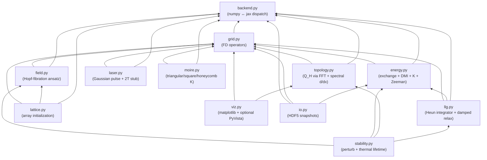

# Architecture

How the code is shaped, why, and what to copy when extending it. The math lives in [PHYSICS.md](PHYSICS.md). Run commands and invariants for day-to-day work live in [../CLAUDE.md](../CLAUDE.md).

## 1. Module dependency graph



Edges point from importer to importee. Bottom of the graph (`backend.py`) has zero internal deps; top (`stability.py`, `viz.py`, `io.py`) sits at the outermost ring of the framework.

## 2. Backend dispatch

A single module — `backend.py` — owns the choice of NumPy vs JAX. Every numerical module imports `xp` from it and never from `numpy`/`jax.numpy` directly. Selection is via env var or runtime call:

```mermaid
sequenceDiagram
  autonumber
  participant Env as os.environ
  participant Backend as hopfion.backend
  participant Module as hopfion.* module
  Env->>Backend: HOPFION_BACKEND=jax (at import)
  Backend->>Backend: use("jax") → load jax + jax.numpy
  Module->>Backend: from hopfion.backend import xp
  Module->>Module: xp().fft.fftn(...)
  Note over Backend,Module: same code path; jit is identity in numpy mode,<br/>jax.jit in jax mode
```

Switching backends mid-run is supported via `hopfion.backend.use("jax")`. The `jit`/`vmap` exports are identity in NumPy mode so production code can stay decorated.

## 3. Field convention

All vector fields are NumPy/JAX arrays of shape `(3, nx, ny, nz)`:
- axis 0: vector component (x, y, z)
- axes 1, 2, 3: spatial grid

Scalar fields are `(nx, ny, nz)`. This layout was picked over `(nx, ny, nz, 3)` because the contiguous "all components at this site" form makes per-component reductions (sum, norm) cleanly slicable as `m[0]`, `m[1]`, `m[2]` — most of the codebase does cross products and component-wise math, not site-wise reductions, so component-first wins on readability.

The `Grid` dataclass (`hopfion.grid.Grid`) carries spacing and BC mode. Two BC modes:
- `"periodic"` — required by `topology.hopf_index` (the FFT curl-inversion assumes it) and recommended for `energy.exchange_energy` (the bond formulation is then exact-adjoint to the 3-point Laplacian field).
- `"open"` — supported for general FD ops; not for the FFT topology pipeline.

## 4. Discretization choices

Three different discretizations live side by side because each is right for its purpose. See [PHYSICS.md §2, §4](PHYSICS.md#2-the-hopf-invariant) for the derivations.

| Module | Operator | Discretization | Why |
|---|---|---|---|
| `grid.py` | gradient, curl, laplacian | central FD | general-purpose, works for periodic and open BC |
| `topology.py` | spatial derivatives in $\mathbf{F}$ | **spectral (FFT)** | central FD gives $O(dx^2)$ error in $Q_H$; spectral is exact for smooth periodic fields |
| `energy.py` | exchange | **bond / forward FD** | exact discrete adjoint of the 3-point Laplacian effective field |
| `energy.py` | DMI curl | central FD | matched to `grid.curl` so `dmi_energy`/`dmi_field` are consistent at finite $dx$ |

Mixing these in the same codebase requires care: don't reach into `topology._spectral_d_axis` from `energy.py`, and don't import `grid.curl` inside the FFT topology pipeline.

## 5. Hopfion stability window

Hopfions are **metastable** in micromagnetics — never the global energy minimum (uniform ferromagnet wins on Zeeman + anisotropy). The damped-LLG relaxation finds the *nearest* local minimum. For the basin around a $Q_H = 1$ ansatz to actually be a local minimum, the material parameters must be in a small window.

In normalized units ($A_{\rm ex} = 1$, $\gamma = 1$):

| Parameter | Working range | Default in notebooks |
|---|---|---|
| $D$ (bulk DMI) | 1.2 – 1.8 | 1.5 |
| $K_u$ (anisotropy) | 0.5 – 0.8 | 0.7 |
| $H_{\rm ext}$ | 0 | 0 |
| Hopfion size $R$ | 1.2 – 2.0 | 1.5 |
| Grid spacing $dx$ | $\le R/4$ | 0.3 |

With weaker DMI the topology decays to $Q_H = 0$ under relaxation. We discovered this window by parameter scan (see git history of notebook 01); the energy + Hopf-index trajectory inside the window looks like:


Notebook 03 ships with these defaults plus the moiré-modulated $K_u(\mathbf{r})$.

## 6. Extension recipes

### A) Adding a new energy term

1. In `src/hopfion/energy.py`, add three things:
   - a field on `EnergyParams` for any new parameters (e.g. `J_dipolar: float = 0.0`)
   - a function `your_energy(m, grid, …)` returning a float
   - a function `your_field(m, grid, …)` returning an `(3, nx, ny, nz)` array such that `your_field = -δE/δm`
2. Wire them into `total_energy` and `effective_field` alongside the existing four terms.
3. Add a row to `tests/test_energy.py::PARAM_SETS` — the existing FD-consistency test will then catch any sign or factor errors automatically.
4. Document the term in [PHYSICS.md §3](PHYSICS.md#3-micromagnetic-energy).

If the term has a non-local structure (e.g. dipolar via FFT convolution), put the convolution kernel in `energy.py` itself — don't add a new module just for that.

### B) Adding a new laser pulse model

1. In `src/hopfion/laser.py`, add a `@dataclass` with the model's parameters.
2. Expose `field_factory(grid) -> Callable[[m, t], H_field]`.
3. Pass it to `llg.integrate(..., H_extra=pulse.field_factory(grid))`.
4. Add at least one test in `tests/test_laser.py` (envelope shape, time peak, etc.).

The Phase-B `TwoTemperaturePulse` is the canonical example: same surface, different physics.

### C) Adding a new moiré lattice geometry

1. In `src/hopfion/moire.py`, add a function `your_kvectors(a_moire)` returning the star of plane-wave wavevectors as a tuple of `(kx, ky, kz)`.
2. Add a branch in `MoirePotential.kvectors()` for the new lattice name.
3. Add a site generator in `src/hopfion/lattice.py` returning a list of `(x, y, z)` tuples on the real-space dual lattice.
4. Add a test in `tests/test_moire.py` checking either the periodicity along an axis (square lattices) or the mean / variance + z-independence (oblique lattices).

For real-space dual lattice computation, recall that the dual of a triangular star-of-three reciprocal lattice is *another* triangular lattice in real space, not a Cartesian one.

### D) Adding a new backend (e.g. PyTorch)

1. Extend `hopfion.backend.use("torch")` to load `torch` and use `torch.fft.*`.
2. Audit every module for `xp().fft.fftn` calls — `torch.fft` has slightly different signature; you may need a thin adapter.
3. Update `to_numpy` to handle `torch.Tensor`.
4. The 24 existing tests give immediate signal: if any fail under the new backend, the adapter is incomplete.

## 7. Test invariants you should not break

These are codified in `tests/`. If you change a discretization or signal flow, re-run the relevant test:

- `tests/test_topology.py` — Hopf index integer-valued for $(p,q)\in\{(1,1)\dots(3,1)\}$. Tightens to ~$10^{-3}$ in practice.
- `tests/test_energy.py` — FD consistency $\partial E/\partial m_i \approx -H_i$ for each energy term in isolation and combined.
- `tests/test_llg.py` — $|\mathbf{m}|=1$ to $10^{-10}$ per step; energy monotonically non-increasing under damped LLG.
- `tests/test_laser.py` — pulse peaks at $t_0$; envelopes localized; Phase-B stub raises `NotImplementedError`.
- `tests/test_moire.py` — moiré field mean = $K_0$; square-lattice variant is exactly periodic in $x$ and $y$.
- `tests/test_io.py` — HDF5 round-trip preserves field and metadata.

## 8. Notebooks as integration tests

Notebooks `01_single_hopfion.ipynb` / `02_laser_nucleation.ipynb` / `03_moire_lattice.ipynb` are de-facto integration tests of the entire stack. Each runs in ≤ 20 s on a laptop. If a code change breaks the end-to-end behavior, one of these notebooks will show $Q_H$ going somewhere unexpected before any single-module test catches it. They are checked into version control with the parameter values that work; treat changes to those defaults as carefully as you'd treat a test threshold.
