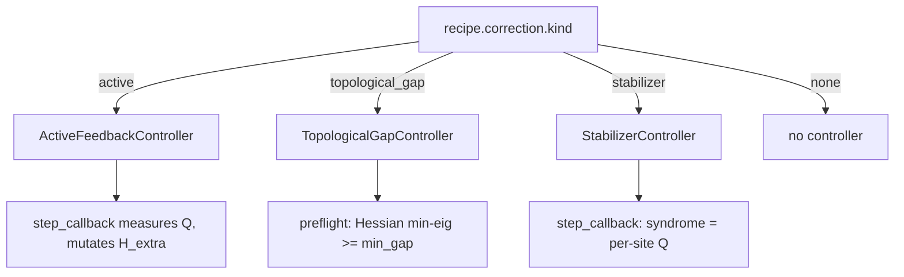

# Error correction for hopfion composite states

Three complementary strategies, all configurable via `recipe.correction.kind`:

- **Active feedback** — closed-loop control. Measure Q_H during the run; on excursion, apply a corrective Zeeman field.
- **Topological-gap engineering** — passive. Verify the Hessian spectrum has no soft modes; pair with Crouch-Grossman to keep numerical drift below the gap.
- **Stabilizer-style code** — code-style. For lattice composites, treat each site as a logical bit; monitor per-site Q for "flips" and trigger localized re-nucleation.

Each is implemented as a controller object that exposes `step_callback(m, k, t)` and optionally `H_extra_factory()`. The pipeline runner wires them into the LLG inner loop.



## A. Active feedback

```yaml
correction:
  kind: active
  target_Q: 1.0
  threshold: 0.1
  gain: 1.0
  cadence: 25
  correction_duration: 5
```

Each `cadence` steps the controller measures $Q_H$. If $|Q - Q_{\rm target}| > \theta$, a corrective Zeeman field is engaged for `correction_duration` steps with amplitude $\propto \text{gain} \cdot |Q - Q_{\rm target}|$. Sign chosen to oppose the deviation.

**Strengths**: rapid recovery from local perturbations.
**Weaknesses**: needs a sensible "corrective vector" (the implementation here uses $\pm\hat z$; richer feedback would target the mode that deviated). Adds Zeeman energy to the bath; can over-shoot if `gain` is high.

**Implementation**: `physics/correction.py::ActiveFeedbackController`.

## B. Topological-gap engineering (passive)

```yaml
correction:
  kind: topological_gap
  min_gap: 0.01
```

Pre-flight runs `lowest_eigenmodes` on the initial state; if any Hessian eigenvalue is below `min_gap`, the run is flagged. Pair with `integrator: crouch_grossman_rk4` to keep numerical $Q_H$ drift below the gap.

**Strengths**: no closed-loop control; the protection is engineered into the Hamiltonian + integrator. Simpler.
**Weaknesses**: only works if a real gap exists. Some composite states (Q$\pm$ pair on a small box) sit at saddles, where this strategy isn't applicable.

**Implementation**: `physics/correction.py::TopologicalGapController`.

## C. Stabilizer-style code

```yaml
correction:
  kind: stabilizer
  expected_sites: 7
  flip_threshold: 0.5
  cadence: 50
  re_nucleation_kT: 8.0
  re_nucleation_steps: 40
```

Every `cadence` steps the controller computes per-site Q via the centroid segmentation. If site count drops below `expected_sites` (a Q-flip has occurred), the syndrome is recorded. In the full implementation, this would trigger a localized two-temperature thermal burst at the missing site to re-nucleate it.

**Strengths**: scales to large lattices; matches quantum-error-correction intuitions.
**Weaknesses**: requires lattice composite states; the local re-nucleation step is currently scaffolded (event logged, but the burst itself is queued for Phase D).

**Implementation**: `physics/correction.py::StabilizerController`.

## Side-by-side comparison protocol

Run the same noisy composite recipe under each correction kind:

```bash
hopfion run recipes/correction_active.yaml
hopfion run recipes/correction_topological_gap.yaml
hopfion run recipes/correction_stabilizer.yaml
hopfion run recipes/correction_none.yaml          # baseline
```

Compare `runs/<name>/summary.json::metrics.q_hopf.Q_final` across the four. Higher retention of the target Q wins.

## Failure-mode catalog

| Mode | Symptom | Diagnose with | Fix |
|---|---|---|---|
| Active correction over-shoots | $Q$ oscillates around target | look at `correction_events` list in summary | lower `gain` |
| Active correction misses event | $Q$ collapses between checks | per-step Q in time-series | tighten `cadence` |
| Topological gap fails preflight | run aborts before LLG starts | `qc.preflight_failures` lists min-eig | change material to widen the gap, or pick a different initial state |
| Stabilizer reports false-positive flip | site count fluctuates due to clustering threshold | `correction_events` shows `n_sites` jumping | raise the centroid threshold; smooth the field first |
| Stabilizer can't keep up | many simultaneous flips | comparison vs uncorrected shows similar fidelity | use active feedback instead |

## See also

- [PIPELINE.md](PIPELINE.md) — recipe schema.
- [QUALITY_CONTROL.md](QUALITY_CONTROL.md) — `syndrome_health` criterion definition.
- [sop/PROTECT_COMPOSITE.md](sop/PROTECT_COMPOSITE.md) — SOP for choosing among the three strategies.
- [api/physics_correction.md](api/physics_correction.md) — module reference.
