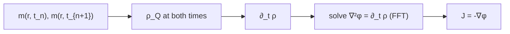

# Flux fields and composite-state propagation

This page covers Phase C: how to quantify where Hopf charge *flows* (the
topological current $\mathbf{J}$), how to track localized hopfions across
time (centroid drift), how to drive them with current (spin-transfer
torque), and how to construct composite states (Q$\pm$ pairs and
hopfion-skyrmion hybrids).

For the underlying simulator see [PHYSICS.md](PHYSICS.md). For the QC
machinery that consumes flux/drift metrics see [QUALITY_CONTROL.md](QUALITY_CONTROL.md).

## 1. Eulerian current $\mathbf{J}(r, t)$

The Hopf-charge density satisfies a continuity equation:

$$\partial_t \rho_Q + \nabla\cdot\mathbf{J} = 0,\qquad \rho_Q = \tfrac{1}{16\pi^2}\,\mathbf{A}\cdot\mathbf{F}.$$

We compute the transport current $\mathbf{J}$ by solving the Poisson equation
$\nabla^2\phi = \partial_t \rho_Q$ in Fourier space and setting
$\mathbf{J} = -\nabla\phi$. The result satisfies $\nabla\cdot\mathbf{J} = -\partial_t \rho_Q$ by construction.

This is the *purely longitudinal* current — the part of the flux that moves
charge. Any divergence-free component (which doesn't transport charge) is
discarded.



Implementation: `src/hopfion/physics/current.py::topological_current`.

**Validation** (`tests/test_current.py`): for a hopfion rigidly translated by
$\mathbf{v}\,dt$, $\mathbf{J}$ has positive z-flux through the equatorial plane
when $v_z > 0$ (charge crosses the plane), with magnitude matching the
expected $\rho_Q(z=0)\,v_z$.

## 2. Lagrangian centroids

Connected-component label `|ρ_Q| > threshold` to segment the field, then take
charge-weighted centroids of each blob:

$$\mathbf{r}_c = \frac{\int \mathbf{r}\,|\rho_Q|\,dV}{\int |\rho_Q|\,dV}.$$

The signed integrated charge gives the topological "polarity" of each
centroid. A Q$\pm$ pair gives two centroids of opposite sign.

Drift velocity comes from central-differencing centroid positions across
adjacent snapshots, assuming the cluster-order is preserved (sorted by
$|Q|$). Implementation: `src/hopfion/physics/current.py::centroids` and
`drift_velocity`.

## 3. Composite-state constructors

Three new initial-state kinds in the recipe schema (see [PIPELINE.md](PIPELINE.md)):

### `q_pair`
Two hopfions of opposite Hopf charge, separated by `separation` along
`axis_of_separation`. The $-Q$ partner is built by spatial reflection of the
$+Q$ ansatz (parity flips the linking number). Avoids the De Moivre
branch-cut problems of raising $v\to v^{-1}$.

### `skyrmion_tube`
2D Bloch- or Néel-type skyrmion extruded uniformly along $z$. Topological
charge per $xy$ slice is $\pm 1$.

### `hopfion_skyrmion_hybrid`
Q$=1$ hopfion threaded by a skyrmion tube through its central ring. The two
ansätze are Gaussian-blended in $\rho$: skyrmion dominates inside the
threading region, hopfion outside.

Implementation: `src/hopfion/physics/composite.py`.

## 4. Spin-transfer torque drive

Zhang-Li LLG:

$$\dot{\mathbf{m}} = -\gamma\,\mathbf{m}\times\mathbf{H}_{\rm eff} + \alpha\,\mathbf{m}\times\dot{\mathbf{m}} - (\mathbf{u}\cdot\nabla)\mathbf{m} + \beta\,\mathbf{m}\times(\mathbf{u}\cdot\nabla)\mathbf{m}.$$

$\mathbf{u}$ is the spin-current-equivalent velocity; $\beta$ is the
non-adiabatic coefficient. For $\beta = \alpha$ the drift velocity equals
$\mathbf{u}$ exactly; for $\beta \ne \alpha$ a transverse component appears
(the "Magnus" force on skyrmions and hopfions).

Recipe step:
```yaml
run:
  - kind: dynamics_stt
    n_steps: 200
    dt: 0.002
    alpha: 0.2
    gamma: 1.0
    u: [0.0, 0.0, 0.08]
    beta: 0.05
```

Implementation: `src/hopfion/physics/stt.py::stt_step_heun`.

## 5. High-order geometric integration

For long-time current-conservation work, use Crouch-Grossman RK4 on $S^2$.
Each step applies a single Rodrigues rotation by an RK4-weighted angular
velocity:

$$\mathbf{m}_{n+1} = R(\Omega)\,\mathbf{m}_n,\qquad \Omega = (\omega_1 + 2\omega_2 + 2\omega_3 + \omega_4)\,\Delta t / 6.$$

$|\mathbf{m}| = 1$ is preserved *exactly* (rotations are isometries) — no
projection drift accumulates. Cost: 4× effective-field evaluations + 1
Rodrigues per cell ($\sim$2× Heun).

Enable via the recipe:
```yaml
run:
  - kind: dynamics_stt
    integrator: crouch_grossman_rk4
```

Implementation: `src/hopfion/physics/high_order.py`.

## 6. New metrics + QC criteria

| Metric | What it records |
|---|---|
| `flux` (FluxAccumulation) | RMS continuity residual $\|\partial_t \rho + \nabla\cdot\mathbf{J}\|$ |
| `drift` (DriftVelocity) | per-centroid positions + max speed across all snapshots |
| `per_site_q` (PerSiteQ) | signed charge of each cluster (for lattice composites) |

| Criterion | Reads | Passes when |
|---|---|---|
| `flux_divergence_below` | `flux.max_residual_rms` | continuity holds |
| `drift_bound` | `drift.max_drift_speed` | per-hopfion drift stays below `max_v` |
| `syndrome_health` | `per_site_q` | site count + Q signature preserved within tolerance |

Enable extended metrics in the recipe:
```yaml
io:
  extended_metrics: true   # adds FluxAccumulation, DriftVelocity, PerSiteQ
```

## 7. Recipe catalog (Phase C)

| Recipe | What it does |
|---|---|
| `recipes/flux_q_pair.yaml` | Q$\pm$ pair under STT; tests flux conservation + dual-centroid tracking |
| `recipes/stt_lattice.yaml` | 7-site moiré lattice under STT; pinning resists drift, syndrome stays at 100% |
| `recipes/hopfion_skyrmion_hybrid.yaml` | Hopfion threaded by skyrmion tube |
| `recipes/regression/flux_conservation_pair.yaml` | locked-down regression |

## 8. Authoring a propagation experiment

1. Pick a composite kind (`q_pair` for clean conservation tests,
   `hopfion_array` for lattice, `hopfion_skyrmion_hybrid` for hybrid).
2. Add a `dynamics_stt` run step with the desired drive `u` and `beta`.
3. Set `io.extended_metrics: true` so flux + drift + per-site Q are collected.
4. Configure `qc.fail_on`/`warn_on` with `flux_divergence_below`,
   `drift_bound`, and/or `syndrome_health` as appropriate.
5. Run: `hopfion run recipes/your_recipe.yaml`.

## See also

- [ERROR_CORRECTION.md](ERROR_CORRECTION.md) — three strategies for protecting composite states.
- [sop/DRIVE_HOPFION.md](sop/DRIVE_HOPFION.md) — SOP for STT drive design.
- [sop/BUILD_COMPOSITE.md](sop/BUILD_COMPOSITE.md) — SOP for composite-state construction.
- [api/physics_current.md](api/physics_current.md), [api/physics_stt.md](api/physics_stt.md), [api/physics_composite.md](api/physics_composite.md), [api/physics_high_order.md](api/physics_high_order.md), [api/physics_correction.md](api/physics_correction.md).
