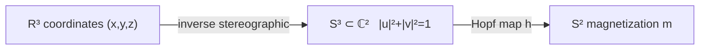
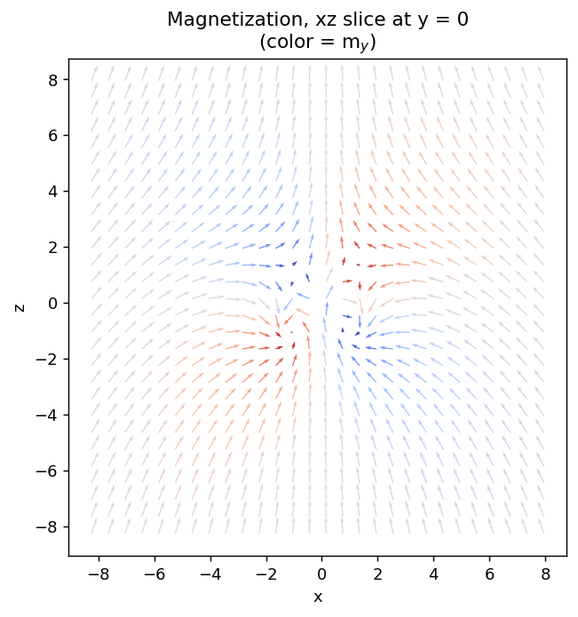
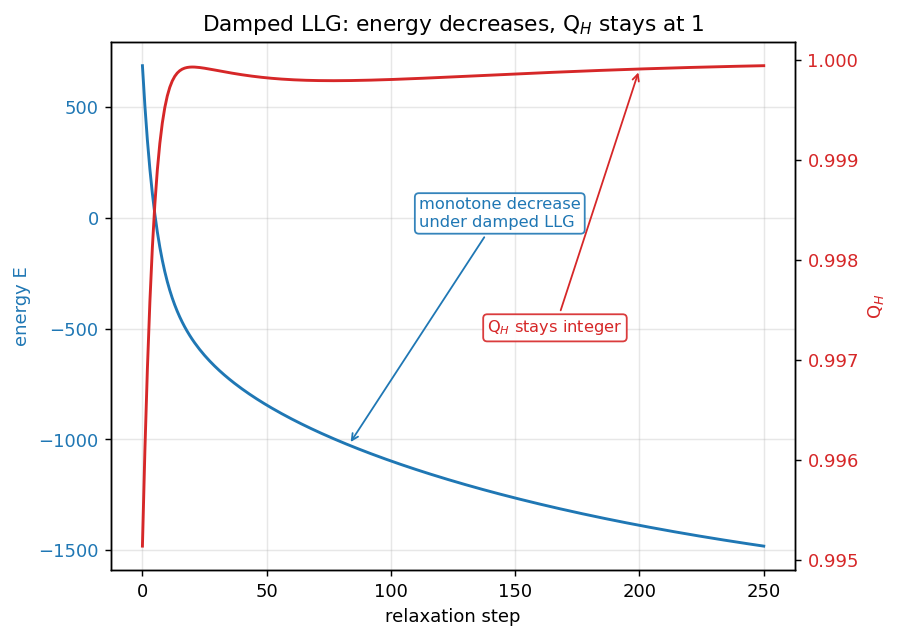
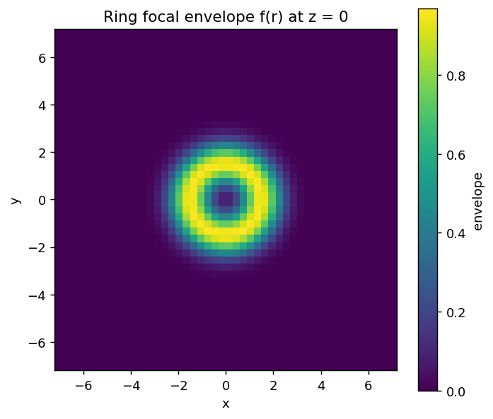
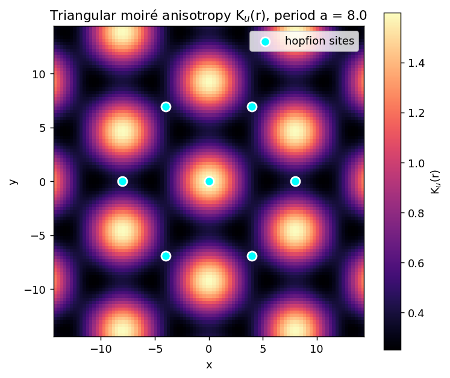
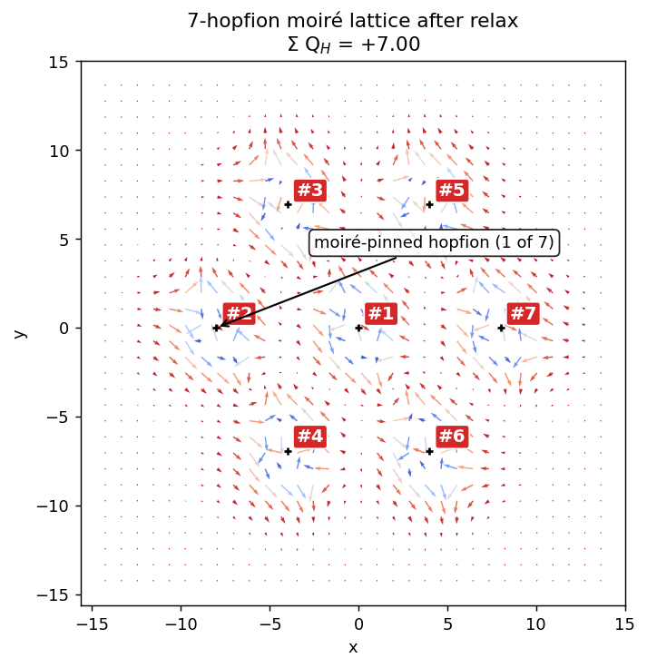

# Physics

This page derives every equation the simulator implements. The code lives in `src/hopfion/`; this file explains *why*. For the developer-facing architecture see [ARCHITECTURE.md](ARCHITECTURE.md).

## 1. The Hopf fibration

A hopfion is a map $\mathbf{m}: \mathbb{R}^3 \to S^2$, $|\mathbf{m}| = 1$, asymptotic to a constant at infinity. Up to homotopy, such maps are classified by the third homotopy group $\pi_3(S^2) = \mathbb{Z}$, whose generator is the **Hopf fibration** $h: S^3 \to S^2$.

**Inverse stereographic projection** $\mathbb{R}^3 \to S^3$ at scale $R$:

$$u(\mathbf{r}) = \frac{R^2 - r^2 + 2 i R z}{R^2 + r^2}, \qquad v(\mathbf{r}) = \frac{2R(x + i y)}{R^2 + r^2}, \qquad |u|^2 + |v|^2 = 1.$$

**Hopf map** $S^3 \to S^2$:

$$\mathbf{m} = \bigl(2\,\mathrm{Re}(u\bar v),\ 2\,\mathrm{Im}(u\bar v),\ |u|^2 - |v|^2\bigr).$$

The composition has Hopf index $Q_H = 1$. Raising $u \to u^p, v \to v^q$ (and re-normalizing on $S^3$) yields $Q_H = p\,q$. The implementation is `src/hopfion/field.py::hopfion`.

xy and xz cuts of the resulting field:

|  |  |
|:--:|:--:|
| equatorial slice (color = $m_z$) | meridional slice (color = $m_y$) |

The "linked rings" picture is the preimage of two antipodal points on $S^2$:

For $Q_H = 1$ those preimages link exactly once. The linking number *is* the Hopf invariant — this is Whitehead's theorem (1947).

## 2. The Hopf invariant

We need to compute $Q_H[\mathbf{m}]$ for any sampled field. Define the closed 2-form on $\mathbb{R}^3$ that is the pull-back of the $S^2$ area form (normalized so $\int_{S^2} = 4\pi$):

$$\mathbf{F}_i = \mathbf{m}\cdot(\partial_j \mathbf{m} \times \partial_k \mathbf{m}), \qquad (i,j,k) \text{ cyclic}.$$

Since $\mathbf{F}$ is divergenceless ($\nabla\cdot\mathbf{F}=0$ identically), we can write $\mathbf{F} = \nabla \times \mathbf{A}$. In Coulomb gauge $\nabla \cdot \mathbf{A} = 0$, the FFT gives the unique solution:

$$\hat{\mathbf{A}}(\mathbf{k}) = \frac{i \mathbf{k} \times \hat{\mathbf{F}}(\mathbf{k})}{|\mathbf{k}|^2}, \qquad (k = 0 \text{ mode set to zero}).$$

The Hopf invariant is

$$\boxed{\ Q_H \;=\; \frac{1}{16\pi^2} \int \mathbf{A} \cdot \mathbf{F}\, d^3 r\ }$$

### Where the $1/(16\pi^2)$ factor comes from

Two factors of $1/(4\pi)$ enter, one for each "$S^2$ area form" appearance:

1. The 2-form $\omega = (1/(4\pi))\,\mathbf{m}^*(\text{area})$ is what integrates to give the skyrmion number — its components are $\omega_{jk} = (1/(4\pi))\,F_{jk}$ where $F_{jk} = \mathbf{m}\cdot(\partial_j \mathbf{m} \times \partial_k \mathbf{m})$. Vector form: $\omega_i = F_i/(4\pi)$.
2. Write $\omega = d\alpha$, so $\alpha_i = A_i/(4\pi)$ where $A_i$ comes from $\nabla \times \mathbf{A} = \mathbf{F}$.
3. The Hopf invariant is $\int \alpha \wedge \omega = \int \alpha \cdot \omega_{vec}\, d^3r = (1/(4\pi))^2 \int \mathbf{A} \cdot \mathbf{F}\, d^3r$.

So $Q_H = (1/(16\pi^2)) \int \mathbf{A}\cdot \mathbf{F}\,d^3r$. Implementation: `src/hopfion/topology.py::hopf_index`.

### Why spectral derivatives are essential

Central finite differences of $\mathbf{m}$ make $\mathbf{F}$ second-order accurate in $dx$, so $Q_H$ converges as $O(dx^2)$ — at $N=64$, $L=16$, $R=1$ the central-FD Hopf index is **7% low**. The FFT step that inverts the curl is already spectral; using spectral derivatives for $\mathbf{F}$ as well makes the entire pipeline spectrally accurate. For smooth, well-localized fields with periodic boundary conditions, the result is exact to 4 sig figs at moderate resolution:

(Implementation: `src/hopfion/topology.py::_spectral_d_axis`.)

## 3. Micromagnetic energy

Energy density terms, with $\mathbf{m}(\mathbf{r})$ a unit vector field. Effective field follows from $\mathbf{H}_{\rm eff} = -\delta E/\delta \mathbf{m}$ (units: $\mu_0 M_s = 1$).

### Heisenberg exchange

$$E_{\rm ex} = A_{\rm ex} \int |\nabla \mathbf{m}|^2 \, d^3 r, \qquad \mathbf{H}_{\rm ex} = 2 A_{\rm ex}\, \nabla^2 \mathbf{m}.$$

### Bulk Dzyaloshinskii–Moriya interaction (Bloch type)

$$E_{\rm DMI} = D \int \mathbf{m}\cdot(\nabla\times\mathbf{m}) \, d^3 r, \qquad \mathbf{H}_{\rm DMI} = -2 D\, \nabla\times\mathbf{m}.$$

The DMI's helicity is what lets non-coplanar textures (skyrmions, hopfions) be local energy minima rather than relaxing to a ferromagnet.

### Uniaxial anisotropy

$$E_{\rm an} = -K_u \int (\mathbf{m}\cdot\hat{e})^2 \, d^3 r, \qquad \mathbf{H}_{\rm an} = 2 K_u (\mathbf{m}\cdot\hat{e})\, \hat{e}.$$

The simulator supports a spatially varying $K_u(\mathbf{r})$ — that's how the toy moiré modulation enters the energy.

### Zeeman

$$E_{\rm Z} = -\int \mathbf{m}\cdot\mathbf{H}_{\rm ext}\, d^3 r, \qquad \mathbf{H}_{\rm Z} = \mathbf{H}_{\rm ext}.$$

Implementation: `src/hopfion/energy.py`. Each term has `_energy(m, grid, …)` and `_field(m, grid, …)` exposed.

## 4. Bond-energy discretization

A subtle point. The continuous identity

$$\frac{\delta}{\delta m_a(\mathbf{r})}\int |\nabla \mathbf{m}|^2\,d^3 r = -2\,\nabla^2 m_a$$

is broken by naïve discretizations. If you discretize $\partial_i m_a$ by **central** finite differences ($m_a(r+\hat e_i) - m_a(r-\hat e_i))/(2 dx)$, then squaring and summing gives an energy whose discrete gradient is a **stretched 5-point** stencil for $\nabla^2$ — *not* the 3-point Laplacian used in the effective field.

Concretely: the central-FD energy gradient at site $\mathbf{r}$ has the form

$$\partial E/\partial m_a(\mathbf{r}) = -\frac{A_{\rm ex}\, dV}{2\,dx^2}\bigl[m_a(\mathbf{r}+2\hat e) - 2 m_a(\mathbf{r}) + m_a(\mathbf{r}-2\hat e)\bigr] + \cdots$$

note the **$\pm 2\hat e$** offsets. The 3-point Laplacian used by `exchange_field` has $\pm \hat e$ offsets. They agree only as $dx \to 0$.

**Fix**: use the **bond formulation** of exchange:

$$E_{\rm ex} = A_{\rm ex}\, dV \sum_{\mathbf{r}} \sum_{i=x,y,z} \frac{|m_a(\mathbf{r}+\hat e_i) - m_a(\mathbf{r})|^2}{dx^2}.$$

Each bond is counted once (forward differences only). Varying $m_a(\mathbf{r})$ in this sum gives terms from the bond $(\mathbf{r}, \mathbf{r}+\hat e_i)$ and $(\mathbf{r}-\hat e_i, \mathbf{r})$, whose sum is **exactly** $-2 A_{\rm ex} dV\,\nabla^2_{\rm 3pt} m_a(\mathbf{r})$.

So total_energy and effective_field become an exact discrete-adjoint pair on a periodic grid. The energy/field FD-consistency test (`tests/test_energy.py`) passes at $10^{-6}$ — the numerical-evaluation floor of central-difference probing the energy.

Implementation: `src/hopfion/energy.py::exchange_energy` (bond form, used only for `bc == "periodic"`; falls back to central-FD for open BC where bond-formulation isn't trivially right anyway).

## 5. LLG dynamics

The Landau–Lifshitz–Gilbert equation in implicit form:

$$\frac{d\mathbf{m}}{dt} = -\gamma\,\mathbf{m}\times\mathbf{H}_{\rm eff} + \alpha\, \mathbf{m}\times\frac{d\mathbf{m}}{dt}.$$

Solving for $d\mathbf{m}/dt$ gives the **explicit form** (assuming $|\mathbf{m}|=1$):

$$\frac{d\mathbf{m}}{dt} = -\gamma\,\mathbf{m}\times\mathbf{H}_{\rm eff}\;-\;\gamma\alpha\,\mathbf{m}\times(\mathbf{m}\times\mathbf{H}_{\rm eff}).$$

The first term is precession around $\mathbf{H}_{\rm eff}$; the second is dissipation pulling $\mathbf{m}$ toward $\mathbf{H}_{\rm eff}$. Setting the precession term to zero gives **damped LLG**:

$$\frac{d\mathbf{m}}{dt} = -\mathbf{m}\times(\mathbf{m}\times \mathbf{H}_{\rm eff}) = \mathbf{H}_{\rm eff} - \mathbf{m}(\mathbf{m}\cdot\mathbf{H}_{\rm eff})$$

which is **gradient descent on the energy** restricted to the unit-sphere tangent plane. The simulator uses this for ground-state finding (`llg.relax`).

After each integrator step we renormalize $\mathbf{m} \to \mathbf{m}/|\mathbf{m}|$ to undo $O(dt^2)$ drift away from $S^2$ — the constraint is enforced to machine precision (~$2\times 10^{-16}$).

### Integrator menu

`src/hopfion/physics/integrators.py` provides:

| Step | Order | Used for |
|---|---|---|
| `heun_step` | 2 | Default — general dynamics, lowest cost. |
| `rk4_step` | 4 | Stiff or long-baseline runs where Heun's $O(dt^2)$ phase error matters. |
| `adaptive_heun_step` | 2 (w/ error estimate) | Step-size control for runs where $dt$ has to track changing field strength. |
| `damped_step` | 1 (gradient flow) | Ground-state finding and relaxation. Used by `llg.relax`. |
| Crouch-Grossman (Phase C) | 2 (geometric, on $S^2$) | Flux-conserving propagation of composite states. See [FLUX_AND_PROPAGATION.md](FLUX_AND_PROPAGATION.md) and [ERROR_CORRECTION.md](ERROR_CORRECTION.md). |

Energy decay and $Q_H$ stability under damped LLG, for a single hopfion:

## 6. Laser pulse models

### Gaussian field pulse (Phase A)

$$\mathbf{H}_{\rm laser}(\mathbf{r}, t) = \mathbf{H}_0\, f(\mathbf{r})\, \exp\!\Bigl(-\frac{(t-t_0)^2}{\tau^2}\Bigr).$$

Spatial envelope $f(\mathbf{r})$ supports point / disk / ring focal profiles. The pulse is added to $\mathbf{H}_{\rm eff}$ via `llg.integrate(..., H_extra=pulse.field_factory(grid))`.

### Topological protection

A **smooth, deterministic field pulse cannot inject Hopf charge into a continuous field**. Reason: the LLG flow is a continuous deformation of $\mathbf{m}$, and $Q_H \in \pi_3(S^2)$ is invariant under continuous deformations. To create a hopfion from a uniform state you must pass through a singularity — a Bloch point in real materials, or (numerically) a discretization-scale defect.

Notebook `02_laser_nucleation.ipynb` demonstrates both: a strong deterministic ring pulse perturbs the field but ends at $Q_H = 0$; a stochastic burst (white-noise field representing electron-temperature spikes) reliably nucleates $Q_H = 1$ on cooling.

### Two-temperature stochastic LLG (Phase B)

The physically correct picture for femtosecond-laser nucleation. Two coupled ODEs for electron and lattice temperatures,

$$C_e \frac{dT_e}{dt} = -G_{\rm el}(T_e - T_l) + P(t), \qquad C_l \frac{dT_l}{dt} = G_{\rm el}(T_e - T_l),$$

drive a stochastic field $\boldsymbol\eta(t)$ in LLG with variance $\langle\eta_i\eta_j\rangle \propto T_e(t)\,\delta_{ij}/\Delta V$. Integration uses Heun-Stratonovich. Implementation: `src/hopfion/physics/two_temp.py::TwoTemperatureLLG` (with a wrapper at `src/hopfion/laser.py::TwoTemperaturePulse`). Driven from a recipe via `run: [{kind: two_temperature_pulse, …}]` — see `recipes/laser_nucleation_2t.yaml`.

## 7. Moiré modulation

A moiré pattern in real space appears when two periodic structures are superposed at a small rotation or scale mismatch. The interference forms a long-wavelength envelope. For a single-layer toy model, the simulator builds the moiré directly in the anisotropy:

$$K_u(\mathbf{r}) = K_0 + V_0 \sum_{i} \cos(\mathbf{k}_i \cdot \mathbf{r}).$$

For a triangular pattern the three star vectors are

$$\mathbf{k}_1 = k\,(1, 0, 0), \quad \mathbf{k}_2 = k\,(-\tfrac12, \tfrac{\sqrt 3}{2}, 0), \quad \mathbf{k}_3 = k\,(-\tfrac12, -\tfrac{\sqrt 3}{2}, 0), \quad k = \tfrac{2\pi}{a_{\rm moiré}}.$$

The minima of $K_u(\mathbf{r})$ form a triangular lattice that pins hopfions; the maxima form an interpenetrating honeycomb that repels them. The implementation is `src/hopfion/moire.py::MoirePotential`.

Plugging $K_u(\mathbf{r})$ in for the scalar $K_u$ in the anisotropy energy term lets a 7-hopfion array survive damped relaxation: each hopfion settles into a moiré-potential minimum.

The bilayer twisted-stack version, where the moiré arises naturally from inter-layer registry mismatch, is Phase B work.

## References

- Whitehead, *An expression of Hopf's invariant as an integral*, Proc. Natl. Acad. Sci. 33, 117 (1947).
- Faddeev & Niemi, *Stable knot-like structures in classical field theory*, Nature 387, 58 (1997).
- Sutcliffe, *Skyrmion knots in frustrated magnets*, Phys. Rev. Lett. 118, 247203 (2017).
- Liu, Watanabe, Nagaosa, *Emergent magnetic monopoles, electron magnetoelectric effects, and topological Hall effects in non-collinear chiral magnets*, J. Phys. Soc. Jpn. 87, 041009 (2018).
- May-2026 phys.org piece: *Laser-isolated hopfions*. https://phys.org/news/2026-05-laser-isolated-hopfions.html
