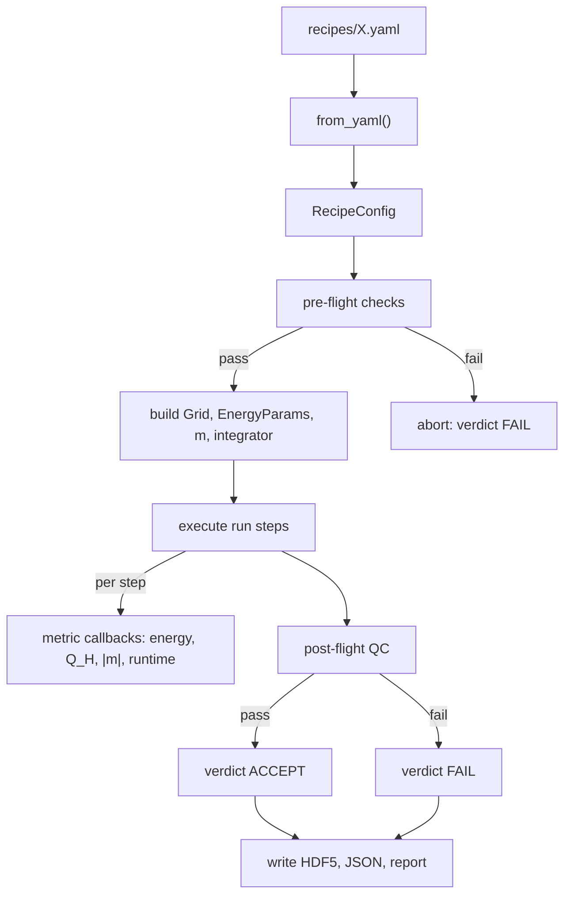

# Pipeline guide

The pipeline is a **simulation-as-fabrication** layer over the simulator. Recipes describe target structures and process steps. The runner orchestrates a single run; the batch runner sweeps parameters and computes yield statistics. Quality-control gates decide accept/reject. Every run leaves an HDF5 + JSON + Markdown report behind.

For the underlying physics see [PHYSICS.md](PHYSICS.md). For the QC reference and failure-mode catalog see [QUALITY_CONTROL.md](QUALITY_CONTROL.md). Phase-A demo notebooks have been ported to recipes in `recipes/`.

## Workflow



## Anatomy of a recipe

```yaml
name: my_recipe
description: |
  Plain prose, copied into the generated report.

grid:
  nx: 48
  ny: 48
  nz: 48
  dx: 0.3                  # dy and dz default to dx
  bc: periodic             # periodic | open

material:
  A_ex: 1.0                # Heisenberg exchange stiffness
  D: 1.5                   # Bulk DMI
  Ku: 0.7                  # Uniaxial anisotropy
  easy_axis: [0, 0, 1]
  H_ext: [0, 0, 0]
  dipolar: false           # B3 -- enable demag field
  moire:                   # optional spatial K modulation (Phase A toy)
    enabled: false
    K0: 0.7
    V0: 0.3
    a_moire: 8.0
    lattice: triangular    # triangular | square | honeycomb

initial:
  kind: hopfion            # hopfion | uniform | perturbed_uniform | hopfion_array | file
  R: 1.5
  p: 1
  q: 1
  # ...kind-specific extras

run:
  - kind: relax            # damped LLG
    n_steps: 250
    dt: 0.002
  # or:
  # - kind: dynamics       # full LLG (precession + damping)
  # - kind: pulse          # Gaussian field pulse
  # - kind: thermal_burst  # white-noise sLLG (Phase A)
  # - kind: two_temperature# Phase-B sLLG driven by electron temperature

qc:
  fail_on:
    - energy_monotonicity: {tol: 1.0e-6}
    - hopf_index_within:   {target: 1.0, tol: 0.05}
    - norm_drift_below:    {tol: 1.0e-10}
  warn_on:
    - runtime_within:      {max_seconds: 60}

io:
  out: runs/my_recipe/
  snapshots_every: 0
  write_report: true

seed: 0
backend: numpy             # numpy | jax
```

## Run-step kinds

| Kind | What it does | Notable fields |
|---|---|---|
| `relax` | Damped-LLG gradient descent | `n_steps`, `dt` |
| `dynamics` | Full LLG (precession + damping) | `gamma`, `alpha`, `dt`, `n_steps` |
| `pulse` | Adds a Gaussian field pulse to LLG | `H0`, `t0`, `tau`, `profile`, `pulse_width`, `ring_radius` |
| `thermal_burst` | Constant-T white-noise sLLG (Phase-A stand-in) | `kT`, `dt`, `n_steps` |
| `two_temperature` | Phase-B physical nucleation engine | `Te_peak`, `tau`, `t0`, `G_el`, `C_e`, `C_l` |

Multiple steps run in sequence. Example: thermal burst followed by relax = "heat + cooldown" workflow.

## Initial-state kinds

| Kind | Builds | Notable fields |
|---|---|---|
| `uniform` | $\mathbf{m}(\mathbf{r}) = \hat e$ | `direction` |
| `perturbed_uniform` | uniform + Gaussian noise | `direction`, `amplitude` |
| `hopfion` | analytic Hopf ansatz, $Q_H = p\cdot q$ | `R`, `p`, `q`, `center`, `axis` |
| `hopfion_array` | site-blended ansätze on a 2D/3D lattice | `R`, `array_lattice`, `array_a`, `array_n_rings` (triangular) or `array_nx`, `array_ny` (square) |
| `file` | load `m` from an HDF5 file | `file_path` |

## CLI

```bash
hopfion run RECIPE                       # single run
hopfion run RECIPE --backend jax         # override
hopfion run RECIPE --out runs/exp1/      # override io.out
hopfion run RECIPE --no-report           # skip report.md

hopfion batch RECIPE --sweep "material.D=0.6,1.0,1.5" --seeds 0:5
hopfion batch RECIPE --sweep "run[0].dt=0.001,0.002,0.005" --workers 4

hopfion ls runs/                         # tabulate verdicts
hopfion report RUN_DIR                   # (re)generate report.md
hopfion qc RUN_DIR                       # re-evaluate QC criteria
```

CLI exit codes: 0 for `ACCEPT`, 2 for `FAIL`. CI workflows rely on this.

## Pre-flight checks (refuse to start)

| Check | Trigger |
|---|---|
| Resolution sanity | `max(dx, dy, dz) > R/2` for hopfion / hopfion_array initial state |
| Box-size vs. hopfion radius | `min(L) < 4R` under periodic BC (avoids periodic-image overlap) |
| Time-step stability | `dt > dx² / (4 A_ex)` (explicit-stencil exchange bound) |
| Dipolar requires periodic BC | `material.dipolar: true` with `grid.bc: open` — the FFT demag kernel raises `ValueError` (`src/hopfion/physics/dipolar.py`) |
| Backend availability | `backend: jax` requested but JAX not installed |

A failing pre-flight aborts the run *before* any LLG step. The verdict is FAIL with the failure recorded in `qc.preflight_failures`.

## In-line metrology (collected during the run)

Cadenced metric callbacks attach to the LLG inner loop and produce a summary + time series:

| Metric | What it records | Cadence |
|---|---|---|
| `energy` | total energy per step | every step |
| `norm_drift` | `max\|m\|-1` per step | every step |
| `q_hopf` | Hopf invariant (FFT-based) | every 25 steps by default |
| `runtime` | wall time per step | every step |

The cadence is configurable via the `MetricCollector`'s `default_metrics(hopf_cadence=N)` for the Hopf-index FFT cost. Histories are serialized to `summary.json` and plotted in the Markdown report.

## Output layout

```
runs/<recipe-name>/
├── run.h5                  # final m + Ku_field (if applicable) + flat metadata attrs
├── summary.json            # recipe (round-tripable), metric summaries + histories, QC, Q_final, wall time
├── report.md               # human-friendly Markdown report
└── figs/
    ├── final_xy.png        # quiver slice of the final state
    ├── energy.png          # energy time series
    ├── q_hopf.png          # Q_H time series
    └── norm_drift.png      # (if drift > 1e-12)
```

## Authoring a new recipe

1. Copy the closest existing recipe under `recipes/`.
2. Edit material parameters; if a hopfion is involved, keep `dx ≤ R/3` and `L > 4R`.
3. Edit the `run:` list (single relax for ground-state finding; thermal_burst → relax for nucleation; pulse → relax for laser-driven studies).
4. Set the `qc.fail_on` list to the invariants you care about. Default starter set: `energy_monotonicity`, `hopf_index_within`, `norm_drift_below`.
5. Run `hopfion run recipes/<name>.yaml`. If pre-flight aborts, fix the offending parameter and retry.
6. Inspect `runs/<name>/report.md`.

## Authoring a regression recipe

1. Put the recipe under `recipes/regression/<name>.yaml`. Make it small and fast (≤ 5 s).
2. Run it once via `hopfion run recipes/regression/<name>.yaml --no-report`.
3. Read the resulting `Q_final`, `E_final`, `max_norm_drift` from `runs/.../summary.json`.
4. Append an entry to `recipes/regression/golden.json` with those values.
5. `tests/test_regression_golden.py` will now lock down that output. Any future change to the simulator that drifts the output beyond tolerance fails CI.

## Authoring a new QC criterion

1. Subclass `hopfion.pipeline.qc.Criterion` and set the `name = "your_name"` class attribute.
2. Implement `evaluate(self, summaries) -> CriterionResult` reading the metric summary dict.
3. Register in `CRITERIA` at the bottom of `qc.py`.
4. Reference it from a recipe via `fail_on: [your_name: {param: value}]`.

## See also

- [QUALITY_CONTROL.md](QUALITY_CONTROL.md) — criterion-by-criterion reference + failure-mode catalog.
- [sop/](sop/) — standard operating procedures for common workflows.
- [ARCHITECTURE.md](ARCHITECTURE.md) — module layout and design rationale.
