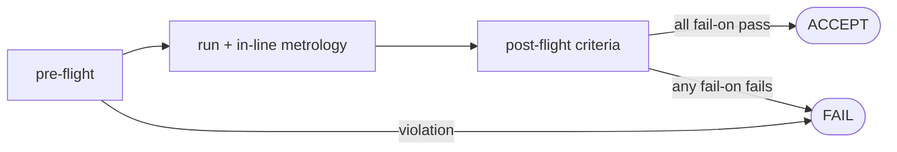

# Quality control

This file is the QC reference: every metric the runner collects, every acceptance criterion the recipe schema understands, and a failure-mode catalog with diagnostic actions.

For how to wire QC into a recipe, see [PIPELINE.md](PIPELINE.md). For the underlying physics, see [PHYSICS.md](PHYSICS.md).

## Philosophy

The runner treats a simulation like a wafer lot. Pre-flight is the dimensional sanity check at process-spec sign-off. In-line metrology runs continuously during the LLG inner loop. Post-flight QC evaluates whether the lot is in-spec. Verdict is binary (`ACCEPT` / `FAIL`); warnings track soft excursions that don't trip the line.

Failures are configurable per recipe via `qc.fail_on:`. Warnings live in `qc.warn_on:` and never flip the verdict.



## Metrics

Each metric collects a time series and emits a summary dict that QC criteria read.

### `energy`
- **Collects**: `total_energy(m, grid, ep)` every step.
- **Summary**: `E_initial`, `E_final`, `max_increase` (max step-to-step increase), `mean_step`, `n_samples`.
- **Use cases**: monotonicity check under damped relax; energy-drift check under undamped dynamics.

### `norm_drift`
- **Collects**: `max(||m| - 1|)` every step.
- **Summary**: `max_drift`, `final_drift`, `n_samples`.
- **Use cases**: catches integrator instability (norm should stay at machine precision).

### `q_hopf`
- **Collects**: `hopf_index(m, grid)` every N steps (default 25 — sub-sampled because the FFT is the cost dominator).
- **Summary**: `Q_initial`, `Q_final`, `max_drift`.
- **Use cases**: topological invariance under dynamics; final-Q acceptance vs target.

### `q_skyrmion` (extended)
- **Collects**: `skyrmion_number(m, grid)` every N steps (default 25). Cheap (finite-difference, no FFT). Part of `extended_metrics`, so enable `io.extended_metrics: true`.
- **Summary**: `N_initial`, `N_final`, `max_drift`, `n_samples`.
- **Use cases**: 2D skyrmion-charge invariance under dynamics; final-$N_{sk}$ acceptance vs target (skyrmion $\approx -1$, antiskyrmion $\approx +1$).

### `runtime`
- **Collects**: wall time per step.
- **Summary**: `total_seconds`, `mean_step_ms`, `p95_step_ms`.
- **Use cases**: performance regression sentinel.

### `per_site_q_voronoi` (extended, lattice runs)
- **Collects**: per-lattice-site Hopf charge by Voronoi-zone integration (`current.per_site_charges`). Auto-added by the runner when `initial.kind == hopfion_array` and `io.extended_metrics`.
- **Summary**: `n_sites`, `Q_per_site_initial`, `Q_per_site_final`.
- **Use cases**: which specific site lost its hopfion (the centroid-based `per_site_q` doesn't tie blobs to sites).

### `correction` (when a `correction:` block is present)
- **Collects**: the controller's running tally (not a per-step metric).
- **Summary**: `kind`, `n_corrections`, `final_fidelity`, `n_events`, and `preflight` (topological_gap only).

### `hessian` (B3, opt-in)
- **Collects**: not collected automatically; populated by a `lowest_eigenmodes` call (e.g. at end of relax).
- **Summary**: `min_eig`, `all_eigs`, `marginally_stable`.

## Acceptance criteria

Recipe key `criterion_name: {param: value}`. Defaults below.

| Name | Reads | Passes when | Default tol |
|---|---|---|---|
| `energy_monotonicity` | `energy.max_increase` | `max_increase < tol` | 1e-6 |
| `hopf_index_within` | `q_hopf.Q_final` | `\|Q_final - target\| < tol` | target=1, tol=0.05 |
| `hopf_index_drift_below` | `q_hopf.max_drift` | `max_drift < tol` | 0.1 |
| `skyrmion_number_within` | `q_skyrmion.N_final` (if collected) | `\|N_final - target\| < tol` | target=1, tol=0.1 |
| `skyrmion_number_drift_below` | `q_skyrmion.max_drift` (if collected) | `max_drift < tol` | 0.1 |
| `norm_drift_below` | `norm_drift.max_drift` | `max_drift < tol` | 1e-10 |
| `runtime_within` | `runtime.total_seconds` | `total < max_seconds` | 60 |
| `min_hessian_eigenvalue` | `hessian.min_eig` (if collected) | `min_eig ≥ tol` | -1e-6 |
| `per_site_voronoi_health` | `per_site_q_voronoi` (if collected) | fraction of occupied sites keeping `\|Q\| ≥ min_abs_q` `≥ min_fidelity` | min_fidelity=0.9, min_abs_q=0.5 |

Severity is set per-criterion via the recipe lists: `fail_on:` makes it a tripwire; `warn_on:` lets it record without flipping the verdict.

## Pre-flight checks

These run *before* the simulation starts. A failure aborts the run (no LLG steps execute), and the verdict is `FAIL`.

| Check | Implementation | Why |
|---|---|---|
| Grid resolution | `max(dx, dy, dz) ≤ R/2` for hopfion ansatz | a hopfion of size $R$ resolved on fewer than ~5 cells per radius has unreliable topology |
| Skyrmion resolution | `max(dx, dy) ≤ radius/2` for skyrmion / skyrmion_tube | an under-resolved skyrmion under-counts $N_{sk}$ |
| Periodic box size | `min(nx·dx, …) > 4R` | avoid periodic-image overlap of the hopfion |
| Exchange-stability dt | `dt ≤ dx² / (4 A_ex)` | explicit Heun is unstable above this |
| Backend availability | importable `jax` if `backend: jax` requested | catch a "missing dep" failure at the recipe stage |

## Failure-mode catalog

Each entry: name, symptom in the report, candidate diagnostic, and fix.

| Mode | What you see | Diagnose with | Typical fix |
|---|---|---|---|
| **Hopfion collapses to FM** | `q_hopf.Q_final ≈ 0`, large negative `energy.E_final` | check `material.D` is in `[1.2, 1.8]`; check `Ku` is in `[0.5, 0.8]` | move into the stability window; for nucleation, increase `Te_peak` |
| **Hopfion fragments** | `q_hopf.Q_final` non-integer (e.g. 0.5) | view `figs/final_xy.png` — likely partial defect | longer relax; tighter `dt`; finer grid |
| **Energy increases mid-relax** | `energy.max_increase > tol` | `dt` too large vs grid | halve `dt`; check pre-flight bound |
| **Norm drift > tol** | `norm_drift.max_drift > tol` | usually integrator instability or float32 backend on a tight tol | loosen tol for JAX (float32) or enable `jax_enable_x64` |
| **Saddle posing as min** | `hessian.min_eig < 0` after relax | `figs/q_hopf.png` looks flat but eigvals show negative modes | relax longer; toggle `dipolar` (changes the energy landscape); different initial state |
| **Pre-flight: under-resolved** | `verdict: FAIL`, `preflight_failures` lists "under-resolved" | obvious | reduce `dx` or increase `R` |
| **Pre-flight: unstable dt** | `dt > dx²/(4 A_ex)` | obvious | reduce `dt` |
| **Pre-flight: small box** | `L < 4R` | obvious | grow `nx, ny, nz` |
| **Runtime regression** | `runtime.mean_step_ms` much higher than usual | per-step plot; compare to `benchmarks/*.csv` | check Hopf-index cadence (`hopf_cadence`); large `nz` slowing FFT |

## Process capability (batch runs)

`hopfion batch` produces yield statistics across a sweep:

```
RECIPE: laser_nucleation_2t × {Te_peak: 15..40, seed: 0..3}
TOTAL RUNS: 16
PASS: 16  FAIL: 0  YIELD: 100%
YIELD BY Te_peak:
  15.0   100%
  25.0   100%
  30.0   100%
  40.0   100%
FAILURE MODES:
  hopf_index_within   0
```

For dichotomous acceptance the headline metric is **yield**. For variability across slices the `BatchReport.cp_index(key, target, half_width)` method returns a Cp-style ratio of spec width to 6σ.

## Authoring a new criterion

```python
# in src/hopfion/pipeline/qc.py
class MyCriterion(Criterion):
    name = "my_criterion"

    def evaluate(self, s):
        tol = float(self.params.get("tol", 1.0))
        measured = float(s.get("my_metric", {}).get("some_field", 0.0))
        return CriterionResult(
            name=self.name, passed=measured < tol, severity=self.severity,
            measured=measured, threshold=tol,
            message=f"my measurement = {measured:.3f} (tol {tol})",
        )

CRITERIA[MyCriterion.name] = MyCriterion
```

If the criterion needs a new in-line metric, also add a `Metric` subclass to `metrics.py` and include it in `default_metrics()`.

## See also

- [PIPELINE.md](PIPELINE.md) — recipe schema, CLI, how to author recipes.
- [sop/](sop/) — Standard Operating Procedures for canonical workflows.
- [ARCHITECTURE.md](ARCHITECTURE.md) — module dependency graph and stability window.
