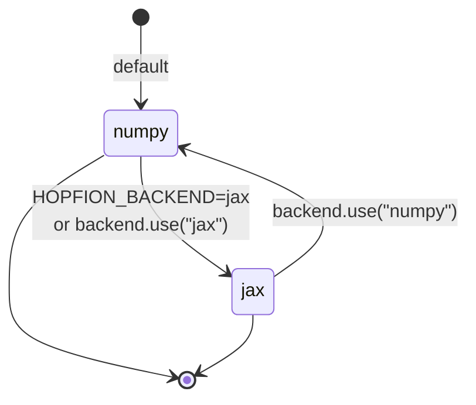

# `hopfion.backend`

Centralized NumPy ↔ JAX dispatch. Every numerical module imports `xp` (and optionally `jit` / `vmap`) from here; nothing else in the codebase imports `numpy` / `jax.numpy` directly.



## Public API

| Symbol | Returns | Purpose |
|---|---|---|
| `use(name)` | `None` | Switch backend: `"numpy"` or `"jax"` |
| `name()` | `str` | Current backend ("numpy" \| "jax") |
| `xp()` | module | Active array module (`numpy` or `jax.numpy`) |
| `jit(fn)` | callable | `jax.jit(fn)` in jax mode, identity in numpy mode |
| `vmap(fn)` | callable | `jax.vmap` in jax mode, `np.vectorize` fallback |
| `asarray(x, dtype=None)` | array | Convert to active backend array |
| `to_numpy(x)` | `np.ndarray` | Coerce back to plain NumPy (no-op in numpy mode) |

## Selection order

1. `hopfion.backend.use(...)` at runtime
2. `HOPFION_BACKEND` env var (read at import)
3. Default: `"numpy"`

## Usage

```python
from hopfion.backend import xp, jit

@jit
def compute(m):
    return xp().sum(m * m)
```

```bash
HOPFION_BACKEND=jax PYTHONPATH=src python3 your_script.py
```

## Caveats

- JAX defaults to **float32**; expect ~1e-3 relative drift vs NumPy's float64. The 24 tests are loose enough to pass under both.
- `jax.jit` shows its biggest speedup on long inner loops (e.g. `lax.scan` over LLG steps). Phase B will harden this.

## See also

- [PHYSICS.md](../PHYSICS.md) — the math
- [ARCHITECTURE.md §2](../ARCHITECTURE.md#2-backend-dispatch) — dispatch design rationale
