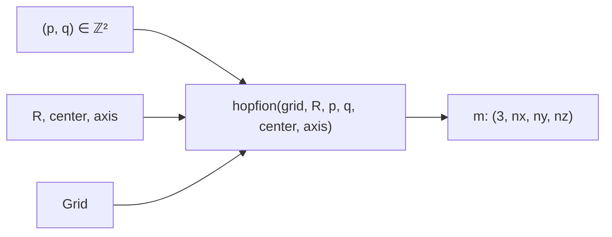

# `hopfion.field`

Analytic hopfion field constructors. Used to (a) initialize relaxation runs and (b) serve as ground-truth for the topology tests.



## Public API

| Function | Returns | Purpose |
|---|---|---|
| `hopfion(grid, R, p=1, q=1, center=(0,0,0), axis="z")` | $(3, n_x, n_y, n_z)$ | Hopf-fibration ansatz with $Q_H = p \cdot q$ |
| `uniform(grid, direction=(0,0,1))` | $(3, n_x, n_y, n_z)$ | Constant field (ferromagnetic ground state) |
| `add_perturbation(m, amplitude=0.01, seed=None)` | $(3, n_x, n_y, n_z)$ | Tangential noise + renormalize |

## Construction (one-line summary)

The implementation does inverse-stereographic $(\mathbb{R}^3 \to S^3)$, optional integer powers $u\!\to\!u^p, v\!\to\!v^q$ via De Moivre, renormalize to $S^3$, then apply the Hopf map $S^3 \to S^2$.

See [PHYSICS.md §1](../PHYSICS.md#1-the-hopf-fibration) for the equations.

## Usage

```python
from hopfion.grid import Grid
from hopfion.field import hopfion, add_perturbation
from hopfion.topology import hopf_index

g = Grid(64, 64, 64, 0.25, 0.25, 0.25, "periodic")

m = hopfion(g, R=1.5, p=1, q=1)
assert abs(hopf_index(m, g) - 1.0) < 0.02   # ≈ 1

m2 = hopfion(g, R=1.0, p=1, q=2)
assert abs(hopf_index(m2, g) - 2.0) < 0.05
```

## Caveats

- `axis="x"` and `axis="y"` rotate the hopfion's central ring; useful for placing oriented hopfions in arrays.
- The De-Moivre branch for $(p \ne 1, q \ne 1)$ uses `atan2` and inherits its discontinuity; the renormalization step smooths most of this out, but very high $(p, q)$ values (>3) can show artifacts at the branch cut.
- For multi-hopfion arrays, do not just superpose multiple `hopfion(...)` outputs — use `hopfion.lattice.array_hopfion` which blends them through a Gaussian envelope and renormalizes.

## See also

- [topology.md](topology.md) — verifies Hopf charge of constructed fields
- [lattice.md](lattice.md) — places multiple hopfions on a lattice
