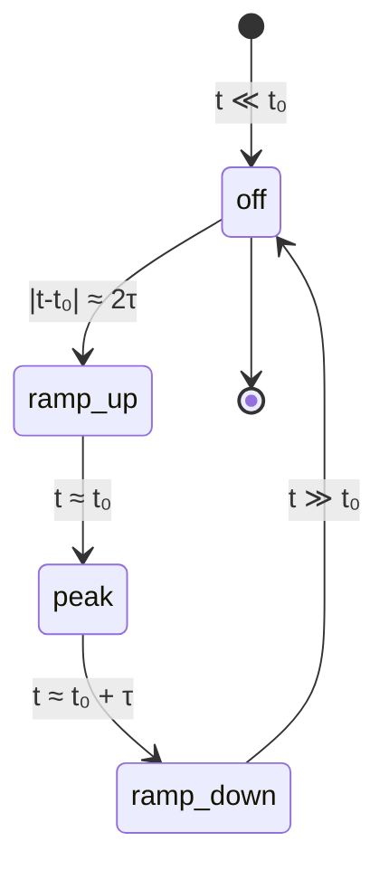

# `hopfion.laser`

Laser pulse models — added as an extra field to the LLG effective field.



## `GaussianPulse` (Phase A)

$$\mathbf{H}_{\rm laser}(\mathbf{r},t) = \mathbf{H}_0\, f(\mathbf{r})\, \exp\!\Bigl(-\frac{(t-t_0)^2}{\tau^2}\Bigr).$$

| Field | Default | Purpose |
|---|---|---|
| `H0` | `(0,0,1)` | Vector amplitude |
| `t0` | 1.0 | Pulse center time |
| `tau` | 0.2 | $1/e$ half-width |
| `profile` | `"point"` | `"point"` \| `"disk"` \| `"ring"` \| `"uniform"` |
| `center` | `(0,0,0)` | Spatial center of the focal envelope |
| `width` | 1.0 | Focal width |
| `ring_radius` | 1.0 | Ring radius (only for `profile="ring"`) |

Methods:
- `spatial_envelope(grid) -> (nx, ny, nz)` — just $f(\mathbf{r})$
- `field_factory(grid) -> Callable[[m, t], H_field]` — what you pass to `llg.integrate`


## `TwoTemperaturePulse` (Phase B stub)

Reserved interface for the upcoming two-temperature stochastic LLG. Currently raises `NotImplementedError`. The mathematics is sketched in [PHYSICS.md §6](../PHYSICS.md#two-temperature-stochastic-llg-phase-b-not-yet-implemented).

## Usage

```python
from hopfion.laser import GaussianPulse
pulse = GaussianPulse(H0=(0,0,-15), t0=0.1, tau=0.04,
                      profile="ring", width=0.6, ring_radius=1.5)
m, snaps, ts = integrate(m, g, ep, lp, n_steps=150,
                         H_extra=pulse.field_factory(g))
```

## Caveats

- **A smooth Gaussian field pulse cannot inject Hopf charge.** Continuous LLG dynamics preserves $Q_H$ exactly. Notebook `02_laser_nucleation.ipynb` demonstrates this and uses a white-noise burst as a stand-in for the Phase-B two-temperature thermal model, which *does* nucleate hopfions on cooling.
- Pulses are evaluated at each LLG sub-step (Heun uses two field evaluations per step). The lambda capture in `field_factory` reuses the spatial envelope; only the time amplitude varies.

## See also

- [PHYSICS.md §6](../PHYSICS.md#6-laser-pulse-models) — pulse equations + topological-protection argument
- [llg.md](llg.md) — `H_extra` callback contract
- Notebook `notebooks/02_laser_nucleation.ipynb`
