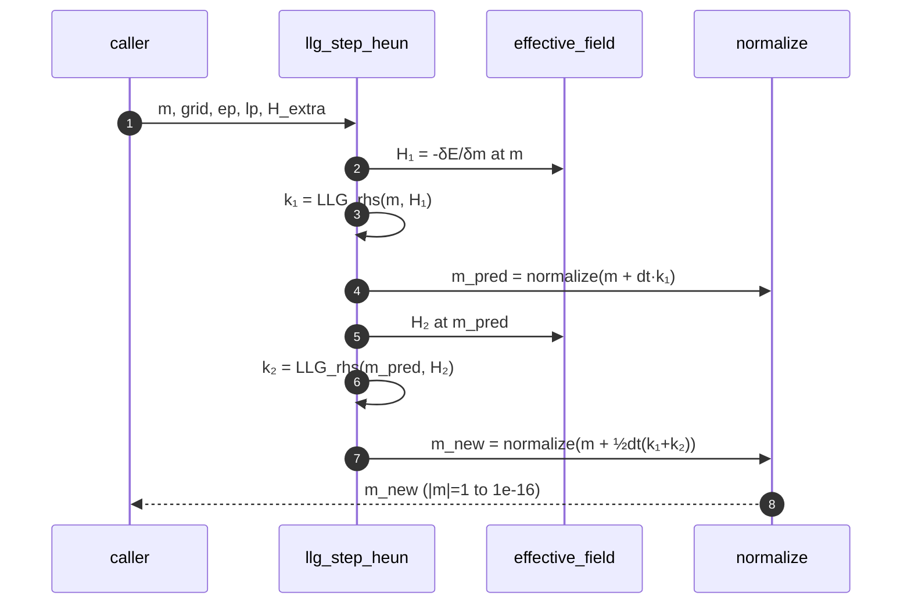

# `hopfion.llg`

Landau–Lifshitz–Gilbert time-stepping. Heun integrator + damped-relax mode.



## `LLGParams` dataclass

| Field | Default | Meaning |
|---|---|---|
| `gamma` | 1.0 | Gyromagnetic ratio (normalized) |
| `alpha` | 0.1 | Gilbert damping |
| `dt` | 0.01 | Time step |

## Public API

| Function | Purpose |
|---|---|
| `llg_step_heun(m, grid, ep, lp, H_extra=None)` | One full-LLG Heun step (precession + damping) |
| `relax_step(m, grid, ep, dt=0.01)` | One step of pure-dissipation gradient flow |
| `relax(m, grid, ep, n_steps, dt, log_every=0)` | Damped-LLG run for ground-state finding |
| `integrate(m, grid, ep, lp, n_steps, H_extra=None, snapshot_every=0)` | Full-LLG run with optional time-dependent external field |

## Usage

```python
from hopfion.llg import LLGParams, integrate, relax
# Find a local minimum
m = relax(m_initial, grid, ep, n_steps=300, dt=0.002)
# Run dynamics with a laser pulse
lp = LLGParams(gamma=1.0, alpha=0.1, dt=0.002)
m, snaps, ts = integrate(m, grid, ep, lp, n_steps=200,
                         H_extra=pulse.field_factory(grid),
                         snapshot_every=20)
```

## Caveats

- **Step-size stability.** The explicit Heun scheme is stable as long as $\Delta t \cdot |\mathbf{H}_{\rm eff,\max}| \lesssim O(1)$. In practice this means $\Delta t \lesssim dx^2 / (4 A_{\rm ex} \alpha)$ for damping-limited stability. Defaults (`dt=0.01`) work at $dx=0.5$; tighten to `dt=0.002` at $dx=0.3$ as in the demo notebooks.
- **`|m|=1` is enforced after every step.** Drift from the constraint is $O(dt^2)$ per step; renormalization makes it $\sim 10^{-16}$.
- `relax_step` drops the precession term — it's gradient flow on the energy. Use it to find minima, never for actual dynamics.

## See also

- [PHYSICS.md §5](../PHYSICS.md#5-llg-dynamics) — equations
- [laser.md](laser.md) — pulses passed via `H_extra`
- [stability.md](stability.md) — perturb + relax, thermal lifetime
