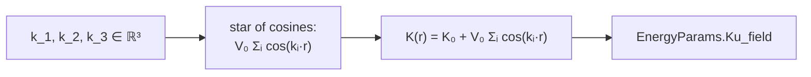

# `hopfion.moire`

Spatially-periodic anisotropy modulation that pins a hopfion lattice.



## `MoirePotential` dataclass

| Field | Default | Purpose |
|---|---|---|
| `K0` | 0.05 | Mean anisotropy |
| `V0` | 0.05 | Modulation amplitude |
| `a_moire` | 5.0 | Moiré lattice constant |
| `lattice` | `"triangular"` | `"triangular"` \| `"square"` \| `"honeycomb"` |

Methods:
- `kvectors() -> tuple[(kx,ky,kz), ...]` — the plane-wave wavevectors
- `Ku_field(grid) -> (nx, ny, nz)` — the $K_u(\mathbf{r})$ array to drop into `EnergyParams(Ku_field=...)`

Free functions: `triangular_2d_kvectors(a)`, `square_2d_kvectors(a)`, `honeycomb_2d_kvectors(a)`.


## Usage

```python
from hopfion.moire import MoirePotential
from hopfion.energy import EnergyParams
mp = MoirePotential(K0=0.7, V0=0.3, a_moire=8.0, lattice="triangular")
ep = EnergyParams(A_ex=1.0, D=1.5, Ku_field=mp.Ku_field(grid),
                  easy_axis=(0,0,1), H_ext=(0,0,0))
```

## Caveats

- **Real-space periodicity ≠ Cartesian periodicity.** The triangular star's dual is a triangular real-space lattice with primitive vectors at $60°$. Don't expect `np.roll` along $x$ to leave the pattern invariant — only along the actual lattice basis vectors.
- The honeycomb option reuses the same three-vector star as triangular (it sits on the honeycomb's Brillouin-zone corners).

## See also

- [lattice.md](lattice.md) — place hopfions at the moiré-lattice sites
- [ARCHITECTURE.md §6C](../ARCHITECTURE.md#c-adding-a-new-moiré-lattice-geometry) — recipe for new geometries
- [PHYSICS.md §7](../PHYSICS.md#7-moiré-modulation) — math
- Notebook `notebooks/03_moire_lattice.ipynb`
