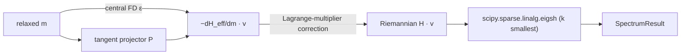

# `hopfion.physics.hessian`

Hessian eigenmode analysis around a relaxed magnetization. Matrix-free
(`scipy.sparse.linalg.eigsh` on a `LinearOperator`); Hessian-vector products
via central FD on `effective_field`.



## Public API

| Symbol | Purpose |
|---|---|
| `hessian_vector_product(m, v, grid, ep, eps=1e-5, H_at_m=None)` | $\text{Hess}_M E \cdot v$ on the unit-sphere tangent bundle |
| `lowest_eigenmodes(m, grid, ep, k=5, eps=1e-5, tol_marginal=1e-3, eigs_tol=1e-4)` | k smallest eigenvalues + modes |
| `SpectrumResult` | dataclass: `eigenvalues`, `eigenmodes`, `min_eig`, `marginally_stable`, `to_metrics_dict()` |

The Hessian-vector product uses the Riemannian formula on $S^2$:

$$\text{Hess}_M E (v) = P\,(d^2 E / dm^2)\,P\,(v) - \lambda(\mathbf{r})\,v_{\rm tangent}, \quad \lambda(\mathbf{r}) = -\mathbf{m}\cdot\mathbf{H}_{\rm eff}.$$

The Lagrange-multiplier subtraction is what makes uniform-FM-along-easy-axis show non-negative eigenvalues; without it the ambient Hessian picks up spurious zero-modes.

## Usage

```python
from hopfion.physics.hessian import lowest_eigenmodes
res = lowest_eigenmodes(m_relaxed, grid, ep, k=4)
print(res.min_eig, res.eigenvalues, res.marginally_stable)
```

## QC integration

The criterion `min_hessian_eigenvalue: {tol: -1e-6}` reads
`summaries["hessian"]["min_eig"]`. The collector that populates that summary
is opt-in (Phase B); typical usage is to compute the spectrum after a
relaxation and attach the result to `summaries["hessian"]`.

## Caveats

- Cost: each matvec is ~2 effective-field evaluations + ~1 cached H_eff. `eigsh` typically calls it ~50× for `k=5`. Budget ~few seconds at 48³.
- The numerical Hessian assumes the relaxation has *converged*; soft modes show up as positive (small) eigenvalues — not negative. If you see clearly negative eigenvalues, the state is a saddle.

## See also

- [SOP-003](../sop/ESTIMATE_LIFETIME.md) — Arrhenius pre-factor estimation.
- [SOP-004](../sop/VALIDATE_NEW_MATERIAL.md) — material-validation diagnostic.
- [QUALITY_CONTROL.md](../QUALITY_CONTROL.md) — `min_hessian_eigenvalue` criterion.
