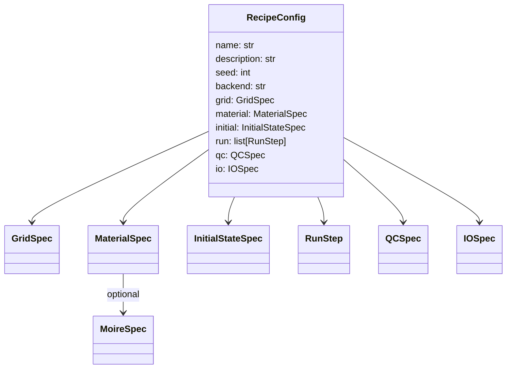

# `hopfion.pipeline.recipe`

Recipe schema (dataclasses) + YAML loader + pre-flight checks.

## Schema



## Public API

| Symbol | Purpose |
|---|---|
| `RecipeConfig.from_yaml(path)` | parse a YAML file |
| `RecipeConfig.from_dict(data)` | build from a Python dict (for tests and CLI overrides) |
| `preflight(rc) -> PreflightResult` | resolution / box / dt / backend checks |

The full schema is documented in [PIPELINE.md](../PIPELINE.md#anatomy-of-a-recipe).

## Pre-flight checks

| Check | Failure → abort |
|---|---|
| `max(dx, dy, dz) > R/2` for hopfion initial states | yes |
| `min(L) < 4R` under periodic BC | yes |
| `dt > dx^2 / (4 A_ex)` for any LLG step | yes |
| `backend: jax` but JAX not importable | yes |
| `R` far from DMI length $L_D = A_{ex}/D$ | warning only |

## Usage

```python
from hopfion.pipeline.recipe import RecipeConfig, preflight
rc = RecipeConfig.from_yaml("recipes/single_hopfion.yaml")
print(rc.material.D)        # 1.5
pre = preflight(rc)
assert pre.passed, pre.failures
```

## See also

- [PIPELINE.md](../PIPELINE.md) — recipe authoring + CLI.
- [pipeline_runner.md](pipeline_runner.md) — what consumes a `RecipeConfig`.
