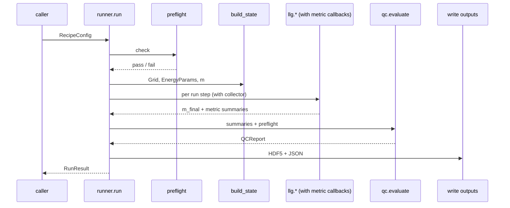

# `hopfion.pipeline.runner`

Single-run orchestrator. Takes a `RecipeConfig`, builds state, executes the run-step list with metric callbacks, evaluates QC, writes outputs.



## Public API

| Symbol | Purpose |
|---|---|
| `run(rc, write=True, hopf_cadence=25) -> RunResult` | execute end-to-end |
| `RunResult` | dataclass: `recipe`, `qc`, `metrics`, `m_final`, `out_dir`, `seconds`, `histories` |
| `build_grid(rc)` | factory |
| `build_energy_params(rc, grid)` | factory (handles moire `Ku_field`) |
| `build_initial_state(rc, grid)` | factory; handles all `initial.kind`s |

## Usage

```python
from hopfion.pipeline.recipe import RecipeConfig
from hopfion.pipeline.runner import run
result = run(RecipeConfig.from_yaml("recipes/single_hopfion.yaml"))
print(result.qc.verdict, result.metrics["q_hopf"]["Q_final"])
```

## Outputs (when `write=True`)

```
runs/<recipe-name>/
├── run.h5             # final m + flat metadata attrs
└── summary.json       # recipe + metric summaries + histories + QC verdict
```

## See also

- [pipeline_recipe.md](pipeline_recipe.md) — input schema.
- [pipeline_qc.md](pipeline_qc.md) — verdict evaluation.
- [pipeline_metrics.md](pipeline_metrics.md) — in-line collectors.
