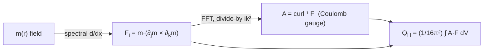
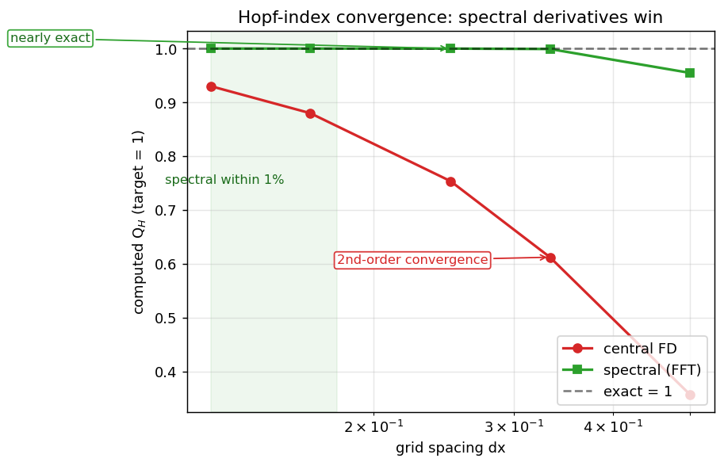

# `hopfion.topology`

Compute the Hopf invariant $Q_H$ and visualization-friendly skyrmion charge / preimage data.



## Public API

| Function | Returns | Purpose |
|---|---|---|
| `hopf_density(m, grid)` | $(3, n_x, n_y, n_z)$ | $\mathbf{F}$ computed via spectral derivatives |
| `gauge_potential(F, grid)` | $(3, n_x, n_y, n_z)$ | $\mathbf{A}$ with $\nabla\times\mathbf{A} = \mathbf{F}, \nabla\cdot\mathbf{A}=0$ |
| `hopf_index(m, grid)` | float | $Q_H$ |
| `skyrmion_density_xy(m, grid)` | $(n_z,)$ | Per-slice skyrmion charge integrated over $(x,y)$ |
| `preimage_mask(m, target, tol=0.15)` | bool array | Cells where $\mathbf{m}\approx \hat{m}_{\rm target}$ |
| `_spectral_d_axis(s, axis, d, n)` | array | Internal: FFT-based derivative (public for reuse) |

## Convergence behavior

Spectral derivatives are essential — central-FD gives only $O(dx^2)$ convergence in $Q_H$:



## Usage

```python
from hopfion.topology import hopf_index, preimage_mask
Q = hopf_index(m, grid)                 # 0.9998 for an analytic Q=1 hopfion at N=64, L=16, R=1
ring_plus  = preimage_mask(m, ( 1, 0, 0))  # boolean (nx, ny, nz) — the +x preimage loop
ring_minus = preimage_mask(m, (-1, 0, 0))  # the -x preimage loop; the two link once for Q=1
```

## Caveats

- **Periodic BC only.** `hopf_density` and `hopf_index` raise `ValueError` on `grid.bc != "periodic"` because the FFT curl-inversion is only valid there.
- **The $1/(16\pi^2)$ factor** comes from two appearances of $1/(4\pi)$ — the $S^2$ area form's normalization, hit once for $\mathbf{F}$ and once for $\mathbf{A}$. See [PHYSICS.md §2](../PHYSICS.md#where-the-116π2-factor-comes-from).
- Preimage extraction is approximate (a thresholded boolean mask). For publication-quality 3D rings use `viz.preimage_pyvista` which calls marching cubes.

## See also

- [PHYSICS.md §2](../PHYSICS.md#2-the-hopf-invariant) — derivation
- [viz.md](viz.md) — preimage rendering
- [field.md](field.md) — what to feed in to verify $Q_H$
