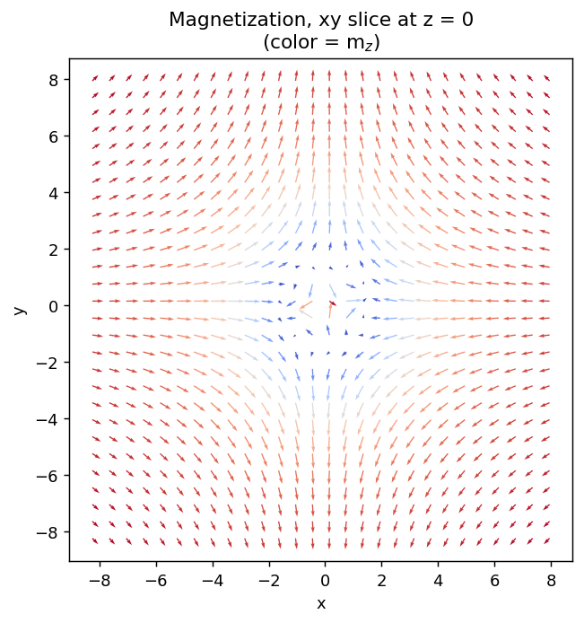
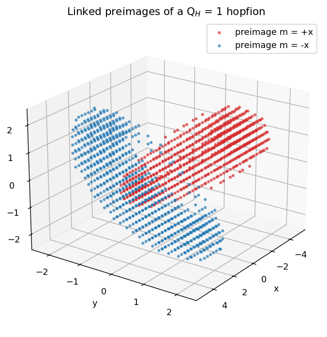

# `hopfion.viz`

Visualization. Static matplotlib for slice quivers + 3D scatter; optional PyVista for marching-cubes preimage rendering.

## Public API

| Function | Output | Backend |
|---|---|---|
| `slice_quiver(m, grid, plane="xy", index=None, stride=2, ax=None)` | matplotlib quiver | mpl |
| `preimage_scatter(m, grid, targets=None, tol=0.1, ax=None)` | 3D scatter (mpl) | mpl |
| `preimage_pyvista(m, grid, targets=None, tol=0.15)` | `pyvista.Plotter` | PyVista |

`slice_quiver` accepts `plane in {"xy", "xz", "yz"}`. `preimage_scatter` defaults to `targets=[(1,0,0), (-1,0,0)]` — the two antipodal-on-$S^2$ preimages whose link gives $Q_H$.

## Examples

```python
import matplotlib.pyplot as plt
from hopfion.viz import slice_quiver, preimage_scatter

fig, ax = plt.subplots(figsize=(6, 5))
slice_quiver(m, grid, plane="xy", stride=2, ax=ax)
```

| Quiver slice | Linked preimages |
|:---:|:---:|
|  |  |

For interactive 3D + screenshots:
```python
plotter = preimage_pyvista(m, grid, tol=0.15)
plotter.show()                  # interactive
plotter.screenshot("out.png")   # headless
```

## Caveats

- `preimage_pyvista` requires `pip install pyvista` (in the optional `[viz]` extra). Without it, `preimage_scatter` is the fallback.
- `slice_quiver`'s `stride` controls density; reduce for higher-resolution grids.

## See also

- [topology.md](topology.md) — `preimage_mask` (the boolean version)
- Notebook `notebooks/01_single_hopfion.ipynb`
