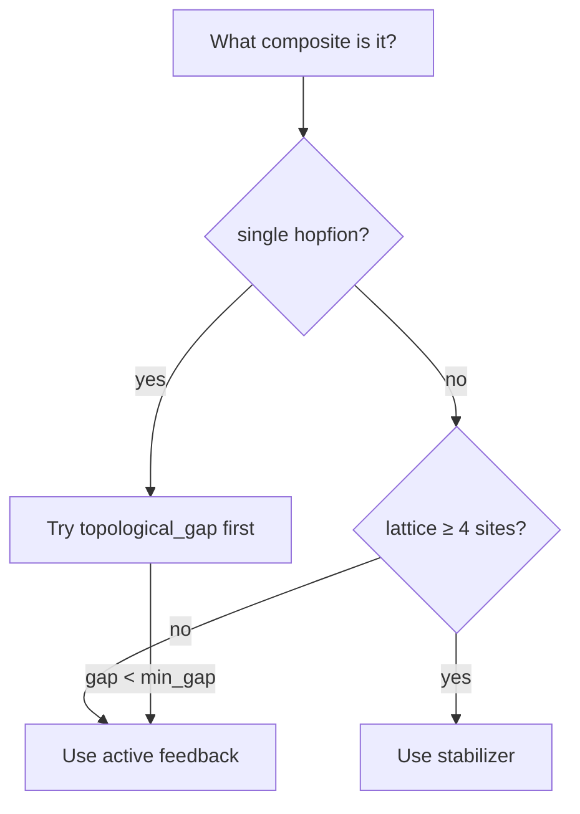

# SOP-007: Choose and configure an error-correction strategy

**Purpose**: given a composite state under a perturbing influence (thermal noise, numerical drift, STT drive that could destabilize topology), choose one of the three error-correction strategies and configure it.

**Recipes**: `recipes/correction_active.yaml`, `recipes/correction_topological_gap.yaml`, `recipes/correction_stabilizer.yaml`.

## Decision tree



## Strategy A: active feedback

**Use when**: single hopfion or pair under moderate noise; per-step measurement is affordable; you have a clear "target Q".

Recipe:
```yaml
correction:
  kind: active
  target_Q: 1.0
  threshold: 0.1
  gain: 1.0
  cadence: 25
  correction_duration: 5
```

Tuning:
- `threshold`: 0.05-0.2. Tighter = more aggressive.
- `gain`: 0.1-2.0. Start at 1.0; reduce if Q oscillates.
- `cadence`: tight enough that Q can't drift past `threshold` between checks.

## Strategy B: topological-gap engineering

**Use when**: you've pre-relaxed the state and confirmed via Hessian that a real gap exists.

Recipe:
```yaml
correction:
  kind: topological_gap
  min_gap: 0.01
run:
  - kind: dynamics
    integrator: crouch_grossman_rk4   # pair with this for best drift
```

Tuning:
- `min_gap`: 0.005-0.05. Set above the noise level you expect.

## Strategy C: stabilizer code

**Use when**: lattice ≥ 4 sites; expected to maintain identical Q on each.

Recipe:
```yaml
correction:
  kind: stabilizer
  expected_sites: 7
  flip_threshold: 0.5
  cadence: 50
```

Tuning:
- `expected_sites`: match the actual lattice site count.
- `cadence`: balance measurement cost vs reactivity.

## Comparison protocol

Run the same noisy recipe under each strategy + an uncorrected baseline. Compare `Q_final` and `syndrome_health` across the four:

```bash
for kind in none active topological_gap stabilizer; do
  hopfion run recipes/correction_${kind}.yaml --out runs/compare/${kind}/
done
hopfion ls runs/compare/
```

Expected ranking on typical thermal-noise composite runs: active > stabilizer > topological_gap > uncorrected.

## References

- [ERROR_CORRECTION.md](../ERROR_CORRECTION.md) — strategy details + failure-mode catalog.
- [api/physics_correction.md](../api/physics_correction.md) — controller API.
