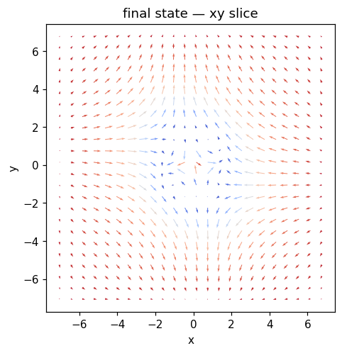
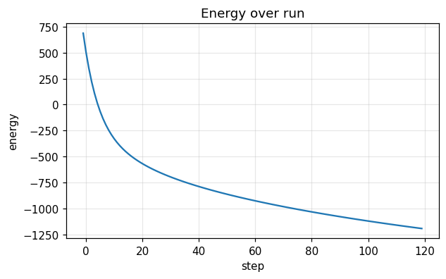
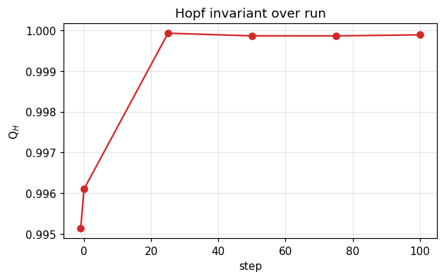

# Run report — `bilayer_demo`

**Verdict**: ✅ **ACCEPT**  ·  wall time: 3.6 s  ·  Q$_H$(final): +0.9999  ·  backend: `numpy`

> Twisted-bilayer coupled relaxation. The recipe's `initial` field is layer 1 (a Q=1 hopfion); the `bilayer` run-step builds layer 2 (uniform +z by default) and relaxes the two layers together under the moiré-registry interlayer exchange of physics/bilayer.py. Layer 1 is tracked by the usual metrics and returned as the primary field; layer 2 is written to run.h5 as the `m2` dataset. With bilayer_J0 = 0 this reduces to an independent single-layer relax. 

## Quality control

| status | criterion | message |
|---|---|---|
| ✅ pass | `norm_drift_below` | max |m|-1 drift = 4.44e-16 (tol 1e-10) |
| ✅ pass | `hopf_index_within` | Q_H final = +0.9999 vs target 1.0 (tol 0.2) |

## Metric summary

```json
{
  "energy": {
    "E_initial": 687.7176226541123,
    "E_final": -1193.7814418544415,
    "max_increase": -3.5582485212048596,
    "mean_step": -15.679158870904615,
    "n_samples": 121
  },
  "norm_drift": {
    "max_drift": 4.440892098500626e-16,
    "final_drift": 3.3306690738754696e-16,
    "n_samples": 121
  },
  "q_hopf": {
    "Q_initial": 0.9951358111738643,
    "Q_final": 0.9998848300774363,
    "max_drift": 0.004788998949434742,
    "n_samples": 6
  },
  "runtime": {
    "total_seconds": 3.5679150400101207,
    "mean_step_ms": 29.98247932781614,
    "p95_step_ms": 33.63855592324398,
    "n_samples": 119
  }
}
```

## Final state



## Time series

### Energy time series



### Hopf invariant



## Recipe

```yaml
name: bilayer_demo
backend: numpy
seed: 0
grid: {"nx": 48, "ny": 48, "nz": 48, "dx": 0.3, "dy": 0.3, "dz": 0.3, "bc": "periodic"}
material: {"A_ex": 1.0, "D": 1.5, "Ku": 0.7, "easy_axis": [0, 0, 1], "H_ext": [0, 0, 0], "dipolar": false, "moire": null}
initial: {"kind": "hopfion", "direction": [0.0, 0.0, 1.0], "R": 1.5, "p": 1, "q": 1, "center": [0.0, 0.0, 0.0], "axis": "z", "amplitude": 0.0, "array_lattice": "triangular", "array_a": 8.0, "array_n_rings": 1, "array_nx": 3, "array_ny": 3, "file_path": null, "separation": 4.0, "axis_of_separation": "x", "skyrmion_radius": 1.0, "skyrmion_helicity": 1.5707963267948966, "skyrmion_vorticity": 1}
run:
  - {"kind": "bilayer", "n_steps": 120, "dt": 0.002, "gamma": 1.0, "alpha": 0.2, "kT": 0.0, "H0": [0.0, 0.0, 0.0], "t0": 0.0, "tau": 0.05, "profile": "point", "pulse_width": 1.0, "ring_radius": 1.5, "Te_peak": 0.0, "G_el": 1.0, "C_e": 1.0, "C_l": 1.0, "u": [0.0, 0.0, 0.0], "beta": 0.0, "integrator": "heun", "bilayer_theta": 0.15, "bilayer_a": 4.0, "bilayer_J0": 0.2, "bilayer_layer2": "uniform"}
```