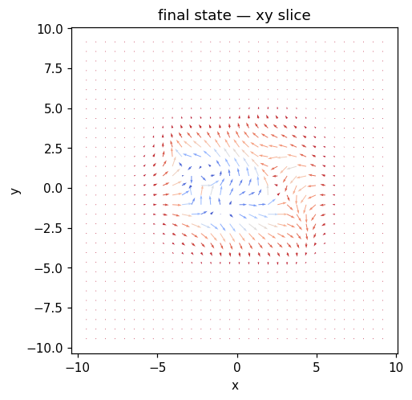
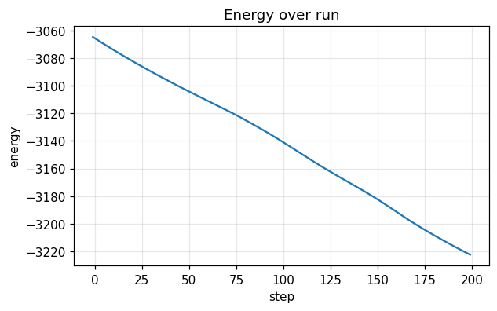
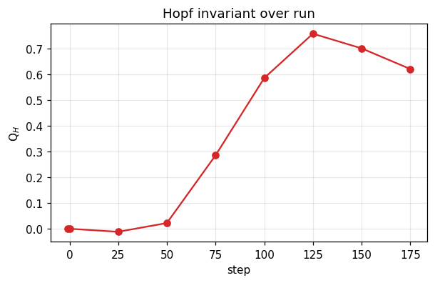

# Run report — `flux_q_pair`

**Verdict**: ✅ **ACCEPT**  ·  wall time: 17.0 s  ·  Q$_H$(final): +0.4946  ·  backend: `numpy`

> Q± hopfion pair drifting under uniform spin-transfer torque. Total Q_H = 0, but the two centroids should drift together along u. Tests Eulerian flux conservation and Lagrangian centroid tracking simultaneously. 

## Quality control

| status | criterion | message |
|---|---|---|
| ✅ pass | `norm_drift_below` | max |m|-1 drift = 3.33e-16 (tol 1e-10) |
| ⚠️ warn | `hopf_index_within` | Q_H final = +0.6211 vs target 0.0 (tol 0.5) |
| ⚠️ warn | `drift_bound` | max centroid drift speed = 100.067 (bound 1.000) |

## Metric summary

```json
{
  "energy": {
    "E_initial": -3064.8098681907795,
    "E_final": -3222.4682326298644,
    "max_increase": -0.6709086989781099,
    "mean_step": -0.7882918221954242,
    "n_samples": 201
  },
  "norm_drift": {
    "max_drift": 3.3306690738754696e-16,
    "final_drift": 2.220446049250313e-16,
    "n_samples": 201
  },
  "q_hopf": {
    "Q_initial": -7.775247349693245e-17,
    "Q_final": 0.6211447983118369,
    "max_drift": 0.7583890038366636,
    "n_samples": 9
  },
  "runtime": {
    "total_seconds": 16.910915661021136,
    "mean_step_ms": 84.97947568352329,
    "p95_step_ms": 128.03400482516736,
    "n_samples": 199
  },
  "flux": {
    "max_residual_rms": 0.0034793200727559603,
    "mean_residual_rms": 0.0019230534503982587,
    "n_samples": 8
  },
  "drift": {
    "n_snapshots": 9,
    "n_centroids_initial": 2,
    "n_centroids_final": 6,
    "max_drift_speed": 100.06670138264899
  },
  "per_site_q": {
    "n_snapshots": 9,
    "n_sites_initial": 2,
    "n_sites_final": 6,
    "Q_per_site_initial": [
      0.5813492339571346,
      -0.5813492339571346
    ],
    "Q_per_site_final": [
      0.31955964901791395,
      0.006781521354679122,
      0.0030730089670489495,
      0.0011997309180726984,
      -0.0010220501023430826,
      -0.0009804446637980552
    ]
  }
}
```

## Final state



## Time series

### Energy time series



### Hopf invariant



## Recipe

```yaml
name: flux_q_pair
backend: numpy
seed: 0
grid: {"nx": 64, "ny": 64, "nz": 48, "dx": 0.3, "dy": 0.3, "dz": 0.3, "bc": "periodic"}
material: {"A_ex": 1.0, "D": 1.5, "Ku": 0.7, "easy_axis": [0, 0, 1], "H_ext": [0, 0, 0], "dipolar": false, "moire": null}
initial: {"kind": "q_pair", "direction": [0, 0, 1], "R": 1.2, "p": 1, "q": 1, "center": [0.0, 0.0, 0.0], "axis": "z", "amplitude": 0.0, "array_lattice": "triangular", "array_a": 8.0, "array_n_rings": 1, "array_nx": 3, "array_ny": 3, "file_path": null, "separation": 5.0, "axis_of_separation": "x", "skyrmion_radius": 1.0, "skyrmion_helicity": 1.5707963267948966}
run:
  - {"kind": "dynamics_stt", "n_steps": 200, "dt": 0.002, "gamma": 1.0, "alpha": 0.2, "kT": 0.0, "H0": [0.0, 0.0, 0.0], "t0": 0.0, "tau": 0.05, "profile": "point", "pulse_width": 1.0, "ring_radius": 1.5, "Te_peak": 0.0, "G_el": 1.0, "C_e": 1.0, "C_l": 1.0, "u": [0.0, 0.0, 0.08], "beta": 0.05, "integrator": "heun"}
```