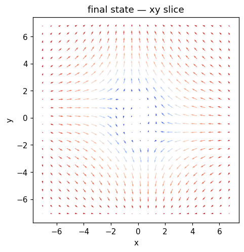
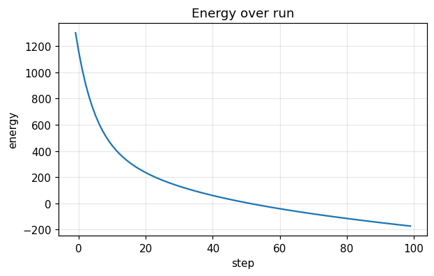
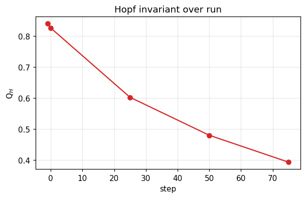

# Run report — `hopfion_skyrmion_hybrid`

**Verdict**: ✅ **ACCEPT**  ·  wall time: 1.2 s  ·  Q$_H$(final): +0.3207  ·  backend: `numpy`

> Hopfion threaded by a skyrmion tube. Both topological objects are blended via Gaussian weight. The composite has a Hopf index close to 1 (the central skyrmion-tube region perturbs but doesn't change the global Hopf invariant). Useful as a stress test of the composite-state apparatus. 

## Quality control

| status | criterion | message |
|---|---|---|
| ✅ pass | `norm_drift_below` | max |m|-1 drift = 3.33e-16 (tol 1e-10) |
| ⚠️ warn | `hopf_index_within` | Q_H final = +0.3936 vs target 1.0 (tol 0.5) |

## Metric summary

```json
{
  "energy": {
    "E_initial": 1301.4993766219116,
    "E_final": -172.7471202193493,
    "max_increase": -2.8411364282826526,
    "mean_step": -14.742464968412607,
    "n_samples": 101
  },
  "norm_drift": {
    "max_drift": 3.3306690738754696e-16,
    "final_drift": 3.3306690738754696e-16,
    "n_samples": 101
  },
  "q_hopf": {
    "Q_initial": 0.8393630238383223,
    "Q_final": 0.39357640998100296,
    "max_drift": 0.4457866138573193,
    "n_samples": 5
  },
  "runtime": {
    "total_seconds": 1.1665134759969078,
    "mean_step_ms": 11.782964404009169,
    "p95_step_ms": 30.252035678131502,
    "n_samples": 99
  },
  "flux": {
    "max_residual_rms": 0.0,
    "mean_residual_rms": 0.0,
    "n_samples": 0
  },
  "drift": {
    "n_snapshots": 5,
    "n_centroids_initial": 1,
    "n_centroids_final": 2,
    "max_drift_speed": 0.0
  },
  "per_site_q": {
    "n_snapshots": 5,
    "n_sites_initial": 1,
    "n_sites_final": 2,
    "Q_per_site_initial": [
      0.363599877473285
    ],
    "Q_per_site_final": [
      0.04809196780003613,
      0.04809196780003611
    ]
  }
}
```

## Final state



## Time series

### Energy time series



### Hopf invariant



## Recipe

```yaml
name: hopfion_skyrmion_hybrid
backend: numpy
seed: 0
grid: {"nx": 48, "ny": 48, "nz": 32, "dx": 0.3, "dy": 0.3, "dz": 0.3, "bc": "periodic"}
material: {"A_ex": 1.0, "D": 1.5, "Ku": 0.5, "easy_axis": [0, 0, 1], "H_ext": [0, 0, 0], "dipolar": false, "moire": null}
initial: {"kind": "hopfion_skyrmion_hybrid", "direction": [0.0, 0.0, 1.0], "R": 1.5, "p": 1, "q": 1, "center": [0.0, 0.0, 0.0], "axis": "z", "amplitude": 0.0, "array_lattice": "triangular", "array_a": 8.0, "array_n_rings": 1, "array_nx": 3, "array_ny": 3, "file_path": null, "separation": 4.0, "axis_of_separation": "x", "skyrmion_radius": 0.8, "skyrmion_helicity": 1.5707963267948966}
run:
  - {"kind": "relax", "n_steps": 100, "dt": 0.002, "gamma": 1.0, "alpha": 0.1, "kT": 0.0, "H0": [0.0, 0.0, 0.0], "t0": 0.0, "tau": 0.05, "profile": "point", "pulse_width": 1.0, "ring_radius": 1.5, "Te_peak": 0.0, "G_el": 1.0, "C_e": 1.0, "C_l": 1.0, "u": [0.0, 0.0, 0.0], "beta": 0.0, "integrator": "heun"}
```