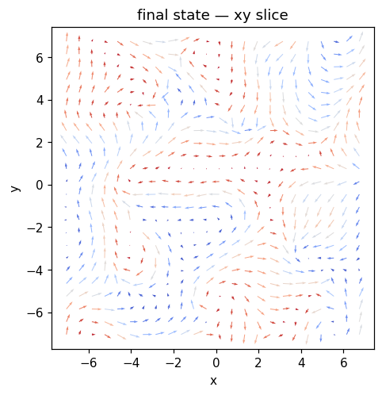
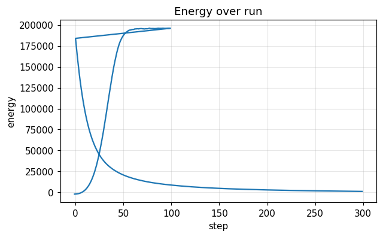
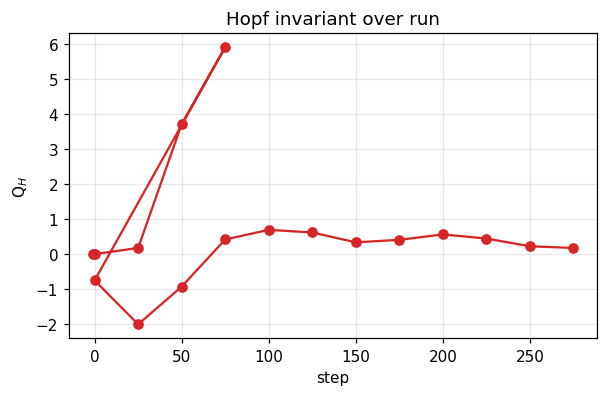

# Run report — `laser_nucleation_2t`

**Verdict**: ✅ **ACCEPT**  ·  wall time: 8.7 s  ·  Q$_H$(final): +0.2144  ·  backend: `numpy`

> Phase-B two-temperature stochastic LLG. A femtosecond pulse spikes the electron-bath temperature; the FDT-consistent stochastic field drives a chaotic spin state from which a Q_H ≈ 1 hopfion can crystallize on cooling. This is the physically grounded successor to recipes/laser_nucleation.yaml. 

## Quality control

| status | criterion | message |
|---|---|---|
| ✅ pass | `norm_drift_below` | max |m|-1 drift = 3.33e-16 (tol 1e-10) |
| ⚠️ warn | `hopf_index_within` | Q_H final = +0.1757 vs target 1.0 (tol 0.5) |
| ✅ pass | `runtime_within` | total runtime = 8.6s (max 60.0s) |

## Metric summary

```json
{
  "energy": {
    "E_initial": -2090.1888,
    "E_final": 1131.2265932456019,
    "max_increase": 7627.837167507765,
    "mean_step": 8.05353848311407,
    "n_samples": 401
  },
  "norm_drift": {
    "max_drift": 3.3306690738754696e-16,
    "final_drift": 3.3306690738754696e-16,
    "n_samples": 401
  },
  "q_hopf": {
    "Q_initial": 0.0,
    "Q_final": 0.17573714666232665,
    "max_drift": 5.917540952466312,
    "n_samples": 17
  },
  "runtime": {
    "total_seconds": 8.615155799023341,
    "mean_step_ms": 21.591869170484564,
    "p95_step_ms": 36.864289402728886,
    "n_samples": 399
  }
}
```

## Final state



## Time series

### Energy time series



### Hopf invariant



## Recipe

```yaml
name: laser_nucleation_2t
backend: numpy
seed: 0
grid: {"nx": 48, "ny": 48, "nz": 48, "dx": 0.3, "dy": 0.3, "dz": 0.3, "bc": "periodic"}
material: {"A_ex": 1.0, "D": 1.5, "Ku": 0.7, "easy_axis": [0, 0, 1], "H_ext": [0, 0, 0], "dipolar": false, "moire": null}
initial: {"kind": "uniform", "direction": [0, 0, 1], "R": 1.5, "p": 1, "q": 1, "center": [0.0, 0.0, 0.0], "axis": "z", "amplitude": 0.0, "array_lattice": "triangular", "array_a": 8.0, "array_n_rings": 1, "array_nx": 3, "array_ny": 3, "file_path": null}
run:
  - {"kind": "two_temperature", "n_steps": 100, "dt": 0.002, "gamma": 1.0, "alpha": 0.1, "kT": 0.0, "H0": [0.0, 0.0, 0.0], "t0": 0.1, "tau": 0.05, "profile": "point", "pulse_width": 1.0, "ring_radius": 1.5, "Te_peak": 20.0, "G_el": 1.0, "C_e": 1.0, "C_l": 1.0}
  - {"kind": "relax", "n_steps": 300, "dt": 0.002, "gamma": 1.0, "alpha": 0.1, "kT": 0.0, "H0": [0.0, 0.0, 0.0], "t0": 0.0, "tau": 0.05, "profile": "point", "pulse_width": 1.0, "ring_radius": 1.5, "Te_peak": 0.0, "G_el": 1.0, "C_e": 1.0, "C_l": 1.0}
```