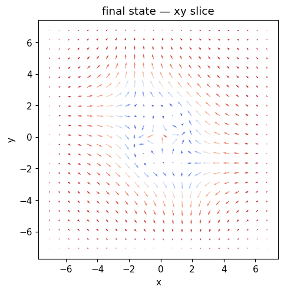
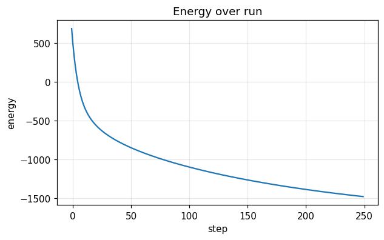
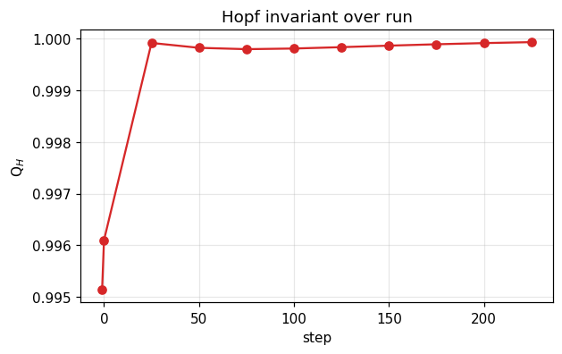

# Run report — `single_hopfion_q1`

**Verdict**: ✅ **ACCEPT**  ·  wall time: 4.5 s  ·  Q$_H$(final): +0.9999  ·  backend: `numpy`

> Phase-A baseline. Build an analytic Q_H=1 hopfion ansatz and relax under exchange + DMI + uniaxial anisotropy. Within the D=1.5, K_u=0.7 stability window, the relaxation lands on a nearby Q_H=1 local minimum. 

## Quality control

| status | criterion | message |
|---|---|---|
| ✅ pass | `energy_monotonicity` | max energy increase per step = -1.641e+00 (tol 1e-06) |
| ✅ pass | `hopf_index_within` | Q_H final = +0.9999 vs target 1.0 (tol 0.05) |
| ✅ pass | `norm_drift_below` | max |m|-1 drift = 4.44e-16 (tol 1e-10) |
| ✅ pass | `runtime_within` | total runtime = 4.4s (max 30.0s) |

## Metric summary

```json
{
  "energy": {
    "E_initial": 687.7176226541123,
    "E_final": -1481.709421063061,
    "max_increase": -1.6413371503322196,
    "mean_step": -8.677708174868695,
    "n_samples": 251
  },
  "norm_drift": {
    "max_drift": 4.440892098500626e-16,
    "final_drift": 3.3306690738754696e-16,
    "n_samples": 251
  },
  "q_hopf": {
    "Q_initial": 0.9951358111738643,
    "Q_final": 0.9999292494648431,
    "max_drift": 0.00479343829097878,
    "n_samples": 11
  },
  "runtime": {
    "total_seconds": 4.423383469984401,
    "mean_step_ms": 17.76459224893334,
    "p95_step_ms": 22.337840357795354,
    "n_samples": 249
  }
}
```

## Final state



## Time series

### Energy time series



### Hopf invariant



## Recipe

```yaml
name: single_hopfion_q1
backend: numpy
seed: 0
grid: {"nx": 48, "ny": 48, "nz": 48, "dx": 0.3, "dy": 0.3, "dz": 0.3, "bc": "periodic"}
material: {"A_ex": 1.0, "D": 1.5, "Ku": 0.7, "easy_axis": [0, 0, 1], "H_ext": [0, 0, 0], "dipolar": false, "moire": null}
initial: {"kind": "hopfion", "direction": [0.0, 0.0, 1.0], "R": 1.5, "p": 1, "q": 1, "center": [0.0, 0.0, 0.0], "axis": "z", "amplitude": 0.0, "array_lattice": "triangular", "array_a": 8.0, "array_n_rings": 1, "array_nx": 3, "array_ny": 3, "file_path": null}
run:
  - {"kind": "relax", "n_steps": 250, "dt": 0.002, "gamma": 1.0, "alpha": 0.1, "kT": 0.0, "H0": [0.0, 0.0, 0.0], "t0": 0.0, "tau": 0.05, "profile": "point", "pulse_width": 1.0, "ring_radius": 1.5, "Te_peak": 0.0, "G_el": 1.0, "C_e": 1.0, "C_l": 1.0}
```