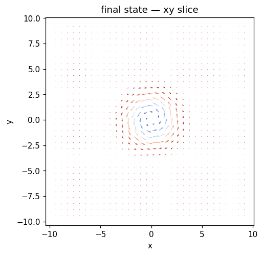
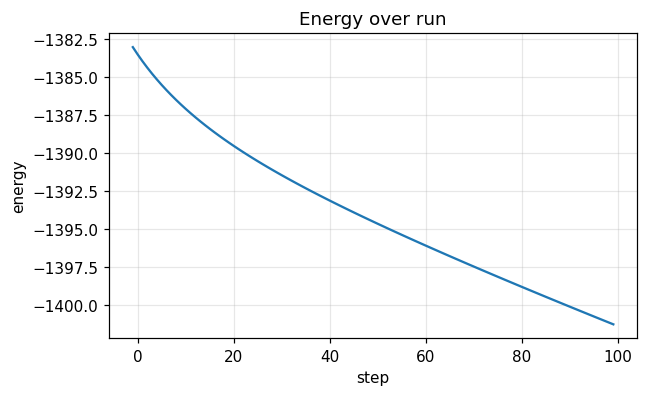
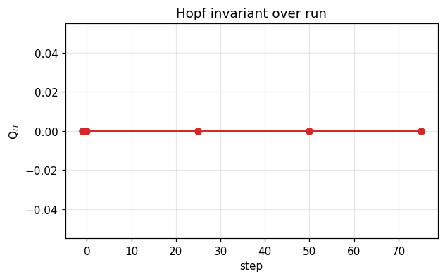

# Run report — `skyrmion_tube`

**Verdict**: ✅ **ACCEPT**  ·  wall time: 2.0 s  ·  Q$_H$(final): +0.0000  ·  backend: `numpy`

> A stand-alone 2D Bloch skyrmion extruded along z, relaxed under damped LLG. The skyrmion number N_sk is a 2D topological invariant (Pontryagin charge), tracked first-class alongside the Hopf index. For this profile N_sk ≈ -1 (set skyrmion_vorticity: -1 for an antiskyrmion with N_sk ≈ +1). The relaxed texture is topologically protected: N_sk stays put while the energy settles. 

## Quality control

| status | criterion | message |
|---|---|---|
| ✅ pass | `norm_drift_below` | max |m|-1 drift = 3.33e-16 (tol 1e-10) |
| ✅ pass | `skyrmion_number_drift_below` | max N_sk drift = 0.0051 (tol 0.1) |
| ✅ pass | `skyrmion_number_within` | N_sk final = -0.9730 vs target -1.0 (tol 0.1) |
| ✅ pass | `energy_monotonicity` | max energy increase per step = -1.273e-01 (tol 1e-06) |

## Metric summary

```json
{
  "energy": {
    "E_initial": -1383.044031875494,
    "E_final": -1401.273344398193,
    "max_increase": -0.1272960060339301,
    "mean_step": -0.18229312522699048,
    "n_samples": 101
  },
  "norm_drift": {
    "max_drift": 3.3306690738754696e-16,
    "final_drift": 2.220446049250313e-16,
    "n_samples": 101
  },
  "q_hopf": {
    "Q_initial": 0.0,
    "Q_final": 0.0,
    "max_drift": 0.0,
    "n_samples": 5
  },
  "q_skyrmion": {
    "N_initial": -0.967946842883782,
    "N_final": -0.9730255377409106,
    "max_drift": 0.0050786948571286405,
    "n_samples": 5
  },
  "runtime": {
    "total_seconds": 1.9151530230301432,
    "mean_step_ms": 19.34498003060751,
    "p95_step_ms": 49.68920398387125,
    "n_samples": 99
  },
  "flux": {
    "max_residual_rms": 0.0,
    "mean_residual_rms": 0.0,
    "n_samples": 0
  },
  "drift": {
    "n_snapshots": 5,
    "n_centroids_initial": 0,
    "n_centroids_final": 0,
    "max_drift_speed": 0.0
  },
  "per_site_q": {
    "n_snapshots": 5,
    "n_sites_initial": 0,
    "n_sites_final": 0,
    "Q_per_site_initial": [],
    "Q_per_site_final": []
  }
}
```

## Final state



## Time series

### Energy time series



### Hopf invariant



## Recipe

```yaml
name: skyrmion_tube
backend: numpy
seed: 0
grid: {"nx": 64, "ny": 64, "nz": 24, "dx": 0.3, "dy": 0.3, "dz": 0.3, "bc": "periodic"}
material: {"A_ex": 1.0, "D": 1.5, "Ku": 0.5, "easy_axis": [0, 0, 1], "H_ext": [0, 0, 0], "dipolar": false, "moire": null}
initial: {"kind": "skyrmion", "direction": [0.0, 0.0, 1.0], "R": 1.5, "p": 1, "q": 1, "center": [0.0, 0.0, 0.0], "axis": "z", "amplitude": 0.0, "array_lattice": "triangular", "array_a": 8.0, "array_n_rings": 1, "array_nx": 3, "array_ny": 3, "file_path": null, "separation": 4.0, "axis_of_separation": "x", "skyrmion_radius": 1.5, "skyrmion_helicity": 1.5707963267948966, "skyrmion_vorticity": 1}
run:
  - {"kind": "relax", "n_steps": 100, "dt": 0.002, "gamma": 1.0, "alpha": 0.1, "kT": 0.0, "H0": [0.0, 0.0, 0.0], "t0": 0.0, "tau": 0.05, "profile": "point", "pulse_width": 1.0, "ring_radius": 1.5, "Te_peak": 0.0, "G_el": 1.0, "C_e": 1.0, "C_l": 1.0, "u": [0.0, 0.0, 0.0], "beta": 0.0, "integrator": "heun"}
```