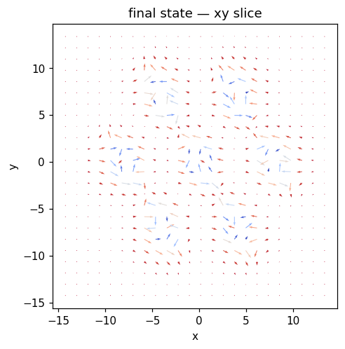
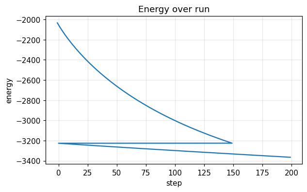
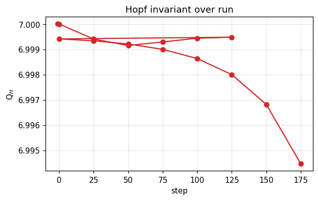

# Run report — `stt_lattice`

**Verdict**: ✅ **ACCEPT**  ·  wall time: 37.8 s  ·  Q$_H$(final): +6.9897  ·  backend: `numpy`

> 7-hopfion moiré lattice under STT drive. The lattice is pinned by the moiré potential, so the STT does work against the pinning. Per-site Q should remain stable; total drift is slow if the pinning wins. 

## Quality control

| status | criterion | message |
|---|---|---|
| ✅ pass | `norm_drift_below` | max |m|-1 drift = 3.33e-16 (tol 1e-10) |
| ✅ pass | `hopf_index_within` | Q_H final = +6.9945 vs target 7.0 (tol 0.5) |
| ✅ pass | `syndrome_health` | syndrome fidelity = 100.00% (min 70%) |

## Metric summary

```json
{
  "energy": {
    "E_initial": -2032.9528153157962,
    "E_final": -3365.340038294188,
    "max_increase": -0.652811158568511,
    "mean_step": -3.80682063708112,
    "n_samples": 351
  },
  "norm_drift": {
    "max_drift": 3.3306690738754696e-16,
    "final_drift": 3.3306690738754696e-16,
    "n_samples": 351
  },
  "q_hopf": {
    "Q_initial": 7.000009624760607,
    "Q_final": 6.994463894724388,
    "max_drift": 0.005545730036219609,
    "n_samples": 15
  },
  "runtime": {
    "total_seconds": 37.60567819495918,
    "mean_step_ms": 107.75265958441027,
    "p95_step_ms": 208.9823109679855,
    "n_samples": 349
  },
  "flux": {
    "max_residual_rms": 0.0003525123984968927,
    "mean_residual_rms": 7.136839194548725e-05,
    "n_samples": 8
  },
  "drift": {
    "n_snapshots": 15,
    "n_centroids_initial": 7,
    "n_centroids_final": 7,
    "max_drift_speed": 7982.126600910052
  },
  "per_site_q": {
    "n_snapshots": 15,
    "n_sites_initial": 7,
    "n_sites_final": 7,
    "Q_per_site_initial": [
      0.5927906261204082,
      0.5927906261204081,
      0.5904073731843981,
      0.5904073731843981,
      0.5904073731843981,
      0.5904073731843981,
      0.5576896137342534
    ],
    "Q_per_site_final": [
      0.7422652505159522,
      0.7420182538627209,
      0.7411975613968788,
      0.73928344339767,
      0.7283818733631575,
      0.7279080440437848,
      0.7276970440348107
    ]
  }
}
```

## Final state



## Time series

### Energy time series



### Hopf invariant



## Recipe

```yaml
name: stt_lattice
backend: numpy
seed: 0
grid: {"nx": 96, "ny": 96, "nz": 32, "dx": 0.3, "dy": 0.3, "dz": 0.3, "bc": "periodic"}
material: {"A_ex": 1.0, "D": 1.5, "Ku": 0.0, "easy_axis": [0, 0, 1], "H_ext": [0, 0, 0], "dipolar": false, "moire": {"enabled": true, "K0": 0.7, "V0": 0.3, "a_moire": 8.0, "lattice": "triangular"}}
initial: {"kind": "hopfion_array", "direction": [0.0, 0.0, 1.0], "R": 1.5, "p": 1, "q": 1, "center": [0.0, 0.0, 0.0], "axis": "z", "amplitude": 0.0, "array_lattice": "triangular", "array_a": 8.0, "array_n_rings": 1, "array_nx": 3, "array_ny": 3, "file_path": null, "separation": 4.0, "axis_of_separation": "x", "skyrmion_radius": 1.0, "skyrmion_helicity": 1.5707963267948966}
run:
  - {"kind": "relax", "n_steps": 150, "dt": 0.002, "gamma": 1.0, "alpha": 0.1, "kT": 0.0, "H0": [0.0, 0.0, 0.0], "t0": 0.0, "tau": 0.05, "profile": "point", "pulse_width": 1.0, "ring_radius": 1.5, "Te_peak": 0.0, "G_el": 1.0, "C_e": 1.0, "C_l": 1.0, "u": [0.0, 0.0, 0.0], "beta": 0.0, "integrator": "heun"}
  - {"kind": "dynamics_stt", "n_steps": 200, "dt": 0.002, "gamma": 1.0, "alpha": 0.2, "kT": 0.0, "H0": [0.0, 0.0, 0.0], "t0": 0.0, "tau": 0.05, "profile": "point", "pulse_width": 1.0, "ring_radius": 1.5, "Te_peak": 0.0, "G_el": 1.0, "C_e": 1.0, "C_l": 1.0, "u": [0.05, 0.0, 0.0], "beta": 0.04, "integrator": "heun"}
```